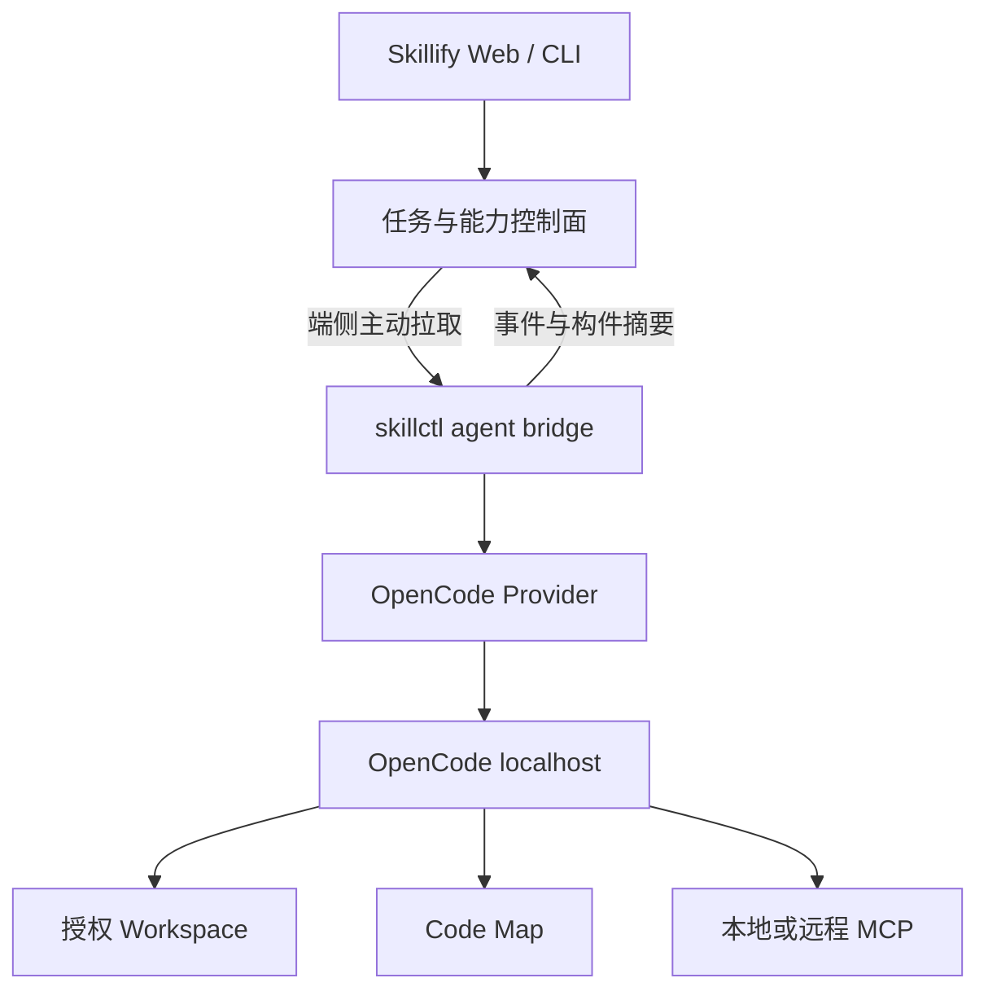
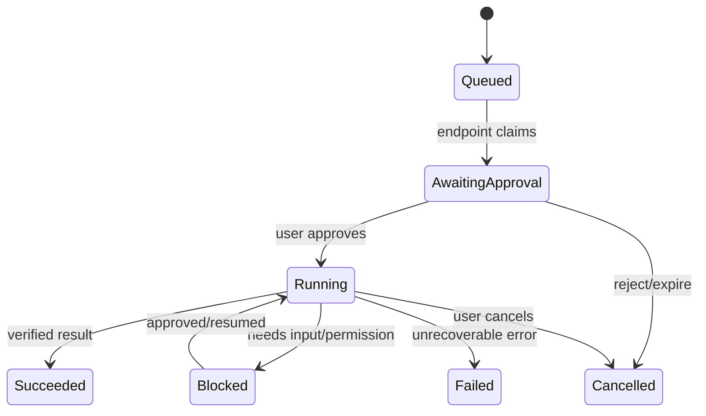

# Skillify 端侧 Agent 生态实施主计划

> **For agentic workers:** REQUIRED SUB-SKILL: Use `superpowers:writing-plans` 完成 Task 0 的仓库二次评定并生成每个阶段的精确文件级实施计划；执行时使用 `superpowers:subagent-driven-development`（推荐）或 `superpowers:executing-plans`，逐 Task 过门禁。所有步骤使用 checkbox 跟踪。

**Goal:** 在不建设服务器执行沙箱、不重写 Agent 运行时的前提下，把 Skillify 扩展为以内网 Skill/MCP 分发治理为中心、由 Linux 端侧 OpenCode 执行、可逐步支持 Web 下达任务和非技术业务应用的本地 Agent 生态。

**Architecture:** 优先扩展现有 `skillctl`，而不是新增一个功能重叠的 CLI。`skillctl agent` 负责端侧安装、配置、权限、任务接收、执行器适配与结果上报；OpenCode 负责 Agent 循环和代码工具执行；Skillify 服务端只做能力分发、任务控制面和审计，不在第一阶段远程执行代码。端侧主动向服务器拉取任务，OpenCode 服务仅监听 `127.0.0.1`。

**Tech Stack:** 现有 Skillify 技术栈、Forgejo、Keycloak/.NET RBAC、DM8、devpi、Linux/XDG、OpenCode Server/OpenAPI/SDK、MCP stdio/Streamable HTTP、Tree-sitter、Universal Ctags、ripgrep、Repomix、Syft/Grype/Cosign（按仓库与内网可用性复用）。

## Global Constraints

- 第一执行器只支持 OpenCode；Claude Code 仅保留 Provider Adapter 接口，完成 OpenCode 验收前不得并行开发。
- 第一阶段所有 Agent 执行发生在用户 Linux 电脑；不建设服务器代码沙箱、远程桌面或容器执行集群。
- 不把服务器“上报”当作执行前置；本地 CLI 开发必须在服务器暂时不可用时仍能工作。
- 服务端不得主动连接用户电脑；端侧通过出站 HTTPS 长轮询或受控 WebSocket 拉取任务。
- OpenCode Server 必须绑定 `127.0.0.1`，随机端口或受控端口，使用临时凭据，不允许监听 `0.0.0.0`。
- 原生文件、Shell、Git、测试能力继续使用 OpenCode 内置工具；不得为了“统一工具链”全部包装成 MCP。
- MCP 用于外部系统和可复用能力适配；本地 MCP 优先 stdio，远程 MCP 优先 Streamable HTTP。
- 数据库 MCP 首版只允许元数据与只读查询，必须具备库/Schema/表白名单、超时、行数和语句类型限制。
- Skill 仍以 Forgejo 不可变构件、checksum、manifest 为唯一可信分发链；每 Skill 独立 `uv` venv 和内网 devpi 不变。
- 不默认扫描整台电脑；每个任务必须绑定明确 workspace 与允许的文件路径。
- LLM 不得无确认生成并运行任意业务脚本；非技术工作流优先执行已评审、版本锁定的 Skill/Python 脚本。
- 不自研通用工作流引擎、IDE、Agent loop、MCP 协议栈、代码解析器、软件包仓库或身份系统。
- 每个阶段必须产生可独立演示、可回滚、可审计的软件；未通过阶段门禁不得进入下一阶段。
- 所有依赖必须适配内网离线安装，锁定版本、许可证、哈希及来源；运行时不得隐式访问公网。

---

## 1. 架构裁决

### 1.1 是否增加端侧 CLI

增加的是“端侧控制能力”，不应直接再造第二个同类 CLI。默认裁决如下：

1. 若仓库已有 `skillctl`：扩展为统一入口，命令放在 `skillctl agent ...` 下。
2. 同一代码库/同一发行包提供两种运行形态：
   - 前台 CLI：开发者手动安装能力、启动会话、执行本地任务、查看状态。
   - 可选 Bridge/daemon：登录后由用户显式启用，主动从 Skillify 拉取 Web 任务并上报事件。
3. OpenCode/Claude Code 是“执行器 Provider”，不是 Skillify 的核心运行时。Skillify 只定义稳定的执行契约。
4. 第一阶段接 OpenCode；后续只有在真实用户需求和内网许可明确后，才实现 Claude Code Provider。

### 1.2 CLI 不是只负责启动

`skillctl agent` 应承担：

- 环境诊断、版本兼容和离线安装检查；
- 安装/升级/回滚 Skill、Workflow Pack、MCP 配置；
- 生成隔离的 OpenCode 配置目录；
- 选择 workspace、执行器、模型配置和权限策略；
- 启停本地 OpenCode，建立会话，消费结构化事件；
- 任务确认、风险升级确认、取消、恢复和本地 outbox；
- 生成最小化执行摘要、测试结果和构件引用；
- 可选地把事件和构件元数据上报到 Skillify。

OpenCode 应继续承担：代码理解、Agent loop、文件编辑、Shell/Git/测试、子 Agent、会话管理和原生权限执行。

### 1.3 目标拓扑



### 1.4 明确不做

- 不把 OpenCode fork 成 Skillify 私有版本。
- 不在 Skillify 服务端托管 OpenCode 进程。
- 不允许 Web 页面无提示地在端侧执行命令。
- 不把“进度百分比”当作核心能力；只上报可验证事件和产物。
- 不首期同时接入 OpenCode、Claude Code、Codex 等多个执行器。
- 不首期做多 Agent 并发写同一工作区；先做串行角色交接。
- 不将 Code Map 简化成目录树或一次性图片；它必须可追溯到代码证据并可供 Agent 查询。

---

## 2. 交付物和阶段依赖

| 阶段 | 交付物 | 依赖 | 通过后可获得的能力 |
| --- | --- | --- | --- |
| S0 | 仓库二次评定与精确实施计划 | 无 | 确认复用点、真实路径、兼容矩阵和阻断项 |
| S1 | `skillctl agent` 本地基础与 OpenCode Provider | S0 | 开发者可在本机可靠启动并控制 OpenCode |
| S2 | Skill/Workflow/MCP 端侧分发与权限 | S1 | 从 Skillify 一键安装、更新、回滚开发能力 |
| S3 | Code Map 本地代码智能 | S2 | 人和 Agent 可快速理解项目结构与证据 |
| S4 | 代码开发 Workflow Packs | S3 | 串行完成理解、计划、实现、测试、评审 |
| S5 | 端侧 Bridge、Web 下达任务与可信上报 | S4 | 非 CLI 用户可安全委派端侧任务 |
| S6 | 数据库/业务 MCP 连接链 | S5 | 代码与业务数据能力可受控串联 |
| S7 | 非技术 Agent Apps | S6 | 文件、表格、文本和报告等模板化业务任务 |
| S8 | 质量、安全和社区增长闭环 | S7 | 基于真实运行数据治理与推广 |

每个阶段完成后必须独立发布；不得做一个覆盖 S1–S8 的长期分支。

---

## 3. Task 节点计划

## S0：仓库二次评定与计划固化

### Task 0.1：建立真实仓库基线

**目的：** 在任何开发前确认现有能力，防止重复创建 CLI、安装器、任务模型和 Agent 适配层。

**只读检查范围：**

- 根目录 `README`、`PLAN`、`TASKS`、`AGENTS.md`、既有设计与评审文档；
- 后端、前端、CLI、webhook、数据库迁移、Forgejo/devpi/Keycloak 集成；
- `skillctl` 命令树、配置结构、安装/回滚、agent adapters 和发布格式；
- 测试、构建、Compose、离线依赖镜像与目标 Linux 发行版。

**步骤：**

- [ ] 使用 `rg --files` 生成仓库文件清单，识别语言、包管理器和测试入口。
- [ ] 使用 `rg` 搜索 `skillctl|agent|opencode|claude|mcp|orchestration|runtime|permissions|devpi|Forgejo`，建立“已有/部分已有/缺失”矩阵。
- [ ] 运行现有 lint、类型检查、单元测试和最小 E2E，记录原始失败，禁止把旧失败归因于新代码。
- [ ] 输出 `docs/assessments/YYYY-MM-DD-endpoint-agent-repository-assessment.md`。
- [ ] 输出 S1 的精确文件级计划 `docs/superpowers/plans/YYYY-MM-DD-s1-opencode-provider.md`，所有 Create/Modify/Test 路径必须来自真实仓库。
- [ ] 提交仅包含评定文档和计划的 commit：`docs: assess endpoint agent integration`。

**评定文档必须回答：**

- 现有 `skillctl` 是否适合扩展，若不适合，具体耦合点和迁移成本是什么；
- CLI 当前语言是否继续使用；禁止仅因个人偏好改写语言；
- OpenCode 能否在目标 Linux/glibc/CPU 上离线安装；
- 内部 OpenAI-compatible 模型端点能否被 OpenCode 正常调用；
- 现有 Agent adapter、配置生成、安装/回滚代码可复用比例；
- P0 就绪度遗留项是否会阻塞 S1；
- 哪些提议依赖许可证或公司安全审批。

**验收门禁 G0：** 真实路径映射、测试基线、Linux 兼容矩阵和 S1 精确计划四项齐全。若 CentOS 7/旧 glibc 不兼容，必须先给出受支持发行版或封装方案，不得直接开发。

### Task 0.2：锁定 ADR 和协议版本

**建议文件：** `docs/adr/ADR-xxx-endpoint-agent-runtime.md`，编号按仓库现有规则确定。

- [ ] 记录“扩展现有 `skillctl`，不新增重叠 CLI”的决策。
- [ ] 记录“OpenCode first，Provider Adapter 隔离”的决策。
- [ ] 记录“本地执行、服务端控制面、端侧主动连接”的信任边界。
- [ ] 记录“原生工具不 MCP 化，外部系统才优先 MCP”的边界。
- [ ] 定义内部协议版本 `task_protocol_version: 1` 和 `provider_contract_version: 1`。
- [ ] 提交：`docs: record endpoint agent architecture decisions`。

## S1：端侧基础与 OpenCode Provider

### Task 1.1：扩展现有 CLI 命令面

**目标命令：**

```text
skillctl agent doctor
skillctl agent init --provider opencode
skillctl agent run --workspace <path> --task <text-or-file>
skillctl agent status
skillctl agent stop
skillctl agent logs --task-id <id>
```

- [ ] 先为命令解析、帮助文本、退出码和配置优先级编写失败测试。
- [ ] 实现 `agent` 命令组，复用现有日志、HTTP、认证和配置设施。
- [ ] 使用 XDG 路径：配置、状态、缓存、日志分离；具体目录名遵循现有 `skillctl` 约定。
- [ ] `doctor` 检查 OS/arch、OpenCode、Git、模型端点、Skill 缓存、MCP 运行时和 workspace 权限。
- [ ] 对所有失败返回稳定机器可读错误码，同时保留人类可读诊断。
- [ ] 完成 CLI 单元测试和 `--help` 快照测试。
- [ ] 提交：`feat(cli): add endpoint agent command group`。

**验收：** 无服务器连接时，`doctor` 和本地 `run` 仍可执行；未授权 workspace 必须失败。

### Task 1.2：定义 Provider Adapter

**逻辑接口（实现语言按现有 CLI 确定）：**

```text
AgentProvider.probe() -> ProviderCapabilities
AgentProvider.start(LaunchSpec) -> ProviderHandle
AgentProvider.create_session(TaskSpec) -> SessionRef
AgentProvider.stream_events(SessionRef) -> TaskEvent stream
AgentProvider.cancel(SessionRef) -> CancelResult
AgentProvider.stop(ProviderHandle) -> StopResult
```

- [ ] 用契约测试覆盖启动、事件顺序、取消、异常退出和清理。
- [ ] 定义标准状态：`queued/awaiting_approval/running/blocked/succeeded/failed/cancelled`。
- [ ] 定义标准事件：`task.accepted`、`plan.ready`、`tool.requested`、`tool.completed`、`test.completed`、`artifact.created`、`task.blocked`、`task.finished`。
- [ ] 事件必须包含 task/session/provider/version/timestamp，禁止默认包含完整 prompt、源码或 secret。
- [ ] 添加一个仅用于测试的 FakeProvider，后续 Bridge 测试不得依赖真实模型。
- [ ] 提交：`feat(agent): define provider execution contract`。

### Task 1.3：实现 OpenCode Provider

- [ ] 使用官方 OpenCode Server/OpenAPI/SDK，优先由 Provider 启动仅监听 `127.0.0.1` 的实例；不得通过脆弱的终端文本 scraping 集成。
- [ ] 配置随机空闲端口、临时强密码、超时和进程组清理。
- [ ] 为每个 workspace 生成隔离配置，合并现有用户配置时遵循 OpenCode 官方优先级。
- [ ] 验证内部模型端点，不在配置或日志中持久化明文密钥。
- [ ] 将 OpenCode 会话/消息/工具事件映射为 Task 1.2 的标准事件。
- [ ] 支持正常结束、用户取消、模型超时、OpenCode 崩溃、CLI 被 SIGTERM 五条路径。
- [ ] 用 Fake HTTP server 完成契约测试，再运行真实 OpenCode smoke test。
- [ ] 提交：`feat(agent): add opencode provider`。

**验收门禁 G1：** 在一台目标 Linux 机器、一个示例仓库中，完成“分析文件 → 修改一处 → 运行测试 → 输出 diff 摘要”，OpenCode 只监听 localhost，停止后无残留进程。

### Task 1.4：离线安装与版本锁定

- [ ] 选择复用现有软件分发方式；不得默认让端侧执行公网 `curl | sh`。
- [ ] 为 OpenCode 和 `skillctl` 记录版本、平台、哈希、许可证和内网制品位置。
- [ ] 验证断网安装、升级、降级和损坏包拒绝。
- [ ] 把兼容矩阵写入用户文档和 `doctor` 规则。
- [ ] 提交：`build(agent): add offline opencode distribution`。

## S2：Skill、Workflow Pack、MCP 与权限

### Task 2.1：OpenCode 配置适配器

- [ ] 从 Skillify manifest 生成 OpenCode Skills/agents/commands/plugin/MCP 配置，不手写第二套元数据源。
- [ ] 支持 user scope 与 project scope，明确覆盖优先级。
- [ ] 安装前生成变更预览；安装后记录 lockfile；卸载只删除归属于该构件的条目。
- [ ] 支持 install/update/rollback/dry-run，并验证幂等。
- [ ] 冲突时拒绝静默覆盖用户自定义配置。
- [ ] 提交：`feat(agent): install skillify capabilities into opencode`。

### Task 2.2：能力锁文件

**最小字段：** `schema_version`、构件类型、名称、版本、Forgejo release/commit、checksum、依赖、安装作用域、生成文件列表、安装时间。

- [ ] 复用现有 manifest 与依赖解析器；不存在时再引入成熟解析库。
- [ ] 生成可复现 lockfile，版本解析禁止“自动漂移到 latest”。
- [ ] 安装时校验 checksum，回滚时不重新解析依赖。
- [ ] 用依赖冲突、循环依赖、缺包、篡改四类测试覆盖。
- [ ] 提交：`feat(agent): lock installed capabilities`。

### Task 2.3：权限 Manifest 与本地确认

**权限维度：** 文件读取/写入路径、命令模式、网络域名、MCP server、数据库资源、是否允许无人值守、是否需要二次确认。

- [ ] 合并 Skill、Workflow、MCP 和任务权限，取更严格规则，禁止“后声明覆盖前拒绝”。
- [ ] 运行前显示 workspace、写路径、命令、网络和 MCP 摘要。
- [ ] `rm`、权限提升、凭据访问、数据库写入、workspace 外写入必须拒绝或二次确认。
- [ ] Web 下达任务首版不允许无人值守写代码；必须在端侧确认。
- [ ] 写入机器可审计的授权记录，但脱敏路径和 secret。
- [ ] 提交：`feat(agent): enforce local capability permissions`。

### Task 2.4：MCP 构件分发

- [ ] 把 MCP server 作为与 Skill 并列的构件元数据，不把运行进程放在 Skillify 服务端。
- [ ] 本地 MCP 使用 stdio 命令与锁定包；远程 MCP 使用 HTTPS URL 与认证引用。
- [ ] 优先复用成熟 MCP runtime/gateway/registry 项目；Task 0 必须给出复用与许可证结论。
- [ ] 安装前进行命令、包来源、网络和权限预览。
- [ ] 完成本地 echo/filesystem 测试 MCP 与内网远程测试 MCP 的 smoke test。
- [ ] 提交：`feat(mcp): distribute governed mcp configurations`。

**验收门禁 G2：** 从 Skillify 安装一个代码开发 Workflow Pack，其 Skill、OpenCode agent/command 和本地 MCP 均可离线安装、更新、回滚，用户配置不被破坏。

## S3：Code Map 本地代码智能

### Task 3.1：复用 OSS 建立语言无关索引管线

- [ ] 使用 `ripgrep` 做文件发现和 ignore 规则；不自研文件遍历语义。
- [ ] 使用 Tree-sitter/Universal Ctags 提取符号；不自研语言 parser。
- [ ] 使用 Repomix 生成受控代码上下文摘要；排除 secret、二进制、vendor 和生成文件。
- [ ] 首批语言按真实用户仓库选择，默认建议 Python → JS/TS → Java → Go，未评定不得一次全上。
- [ ] 输出版本化 `code-map.json`，每个节点包含文件、行号、解析器版本和内容哈希。
- [ ] 对增量更新、删除、重命名、语法错误和超大仓库编写测试。
- [ ] 提交：`feat(codemap): build evidence-linked repository index`。

### Task 3.2：定义 Code Map 数据模型

**最小节点：** repository、module/package、file、symbol、API endpoint、data entity、test、entrypoint。

**最小边：** contains、imports、calls、implements、reads/writes、tests、routes-to。

- [ ] 节点 ID 稳定且可增量重建。
- [ ] 所有推断关系标记 confidence/source，不把 LLM 猜测伪装成静态事实。
- [ ] Code Map 生成失败不得阻塞 OpenCode 普通开发任务。
- [ ] 提交：`feat(codemap): define graph schema and incremental store`。

### Task 3.3：提供人类视图与 Agent 查询

- [ ] CLI 支持 `skillctl map build/status/query/export`。
- [ ] 提供模块、入口、依赖、API、数据和测试覆盖查询。
- [ ] 通过本地 stdio MCP 暴露受限查询工具，返回证据位置而非整仓源码。
- [ ] Web 侧首版只读展示，可用 Mermaid/markmap/Vue Flow 中与现有前端匹配的库；不得引入 React Flow 到 Vue 项目。
- [ ] 提交：`feat(codemap): expose cli mcp and read-only views`。

**验收门禁 G3：** 对真实中型仓库，首次索引和增量索引达到 Task 0 设定的性能预算；五类查询均能跳转到真实代码证据，解析失败有明确降级。

## S4：代码开发 Workflow Packs

### Task 4.1：Project Onboarding Pack

- [ ] 串行角色：仓库分析者 → 架构摘要者 → 风险/测试入口识别者。
- [ ] 输入限定 workspace；输出 `project-brief.md` 和 Code Map 引用。
- [ ] 不修改源码；默认只读权限。
- [ ] 用三个代表性仓库制作离线 golden tests。
- [ ] 提交：`feat(workflows): add project onboarding pack`。

### Task 4.2：Bugfix Pack

- [ ] 串行角色：复现者 → 根因分析者 → 实现者 → 测试者 → Reviewer。
- [ ] 未形成可复现证据时不得直接改代码；无法复现要输出 blocker。
- [ ] 产物包括复现命令、失败测试、补丁、通过测试和剩余风险。
- [ ] 提交：`feat(workflows): add evidence-driven bugfix pack`。

### Task 4.3：Feature Pack

- [ ] 串行角色：需求澄清 → 代码定位 → 实施计划 → TDD 实现 → Review。
- [ ] 计划审批为可配置门禁；Web 任务默认必须审批计划后写代码。
- [ ] 产物包括计划、变更、测试和使用说明。
- [ ] 提交：`feat(workflows): add feature development pack`。

### Task 4.4：Review/Refactor Pack

- [ ] Review 只报告有证据的问题，带文件位置、影响和复现/验证方式。
- [ ] Refactor 必须先记录行为基线和测试覆盖，默认不改变外部行为。
- [ ] 报告等级与现有团队规范一致，不另造一套严重度体系。
- [ ] 提交：`feat(workflows): add review and refactor packs`。

**验收门禁 G4：** 四个 Pack 可从 Skillify 安装，在 CLI 中执行并产生结构化结果；角色默认串行，失败能在正确节点终止或恢复。

## S5：端侧 Bridge、Web 任务和可信上报

### Task 5.1：定义任务协议

**TaskEnvelope 最小字段：**

```json
{
  "protocol_version": 1,
  "task_id": "uuid",
  "user_id": "subject",
  "endpoint_id": "uuid",
  "workflow_ref": {"name": "bugfix", "version": "locked"},
  "workspace_ref": "local-alias",
  "input": {},
  "requested_permissions": {},
  "expires_at": "RFC3339",
  "idempotency_key": "opaque"
}
```

- [ ] 服务器不接收任意本地绝对路径；使用端侧用户预先登记的 workspace alias。
- [ ] 请求签名/令牌、过期、重放、撤销和幂等均有测试。
- [ ] 任务状态转换使用 compare-and-set，重复拉取不得重复执行。
- [ ] 提交：`feat(tasks): define endpoint task protocol`。

### Task 5.2：实现 Bridge/daemon 模式

```text
skillctl agent connect
skillctl agent bridge start --foreground
skillctl agent bridge status
skillctl agent bridge stop
```

- [ ] 复用 `skillctl` 认证；设备注册使用短期绑定码或公司批准的设备凭据。
- [ ] 端侧主动拉取任务；网络断开指数退避并进入本地 outbox。
- [ ] 收到任务先展示来源、workspace、Workflow、Skill/MCP 和权限摘要。
- [ ] 用户拒绝、超时、取消、执行失败均上报确定状态。
- [ ] 默认前台运行；systemd user service 作为显式可选安装，不要求 root。
- [ ] 提交：`feat(agent): add opt-in endpoint bridge`。

### Task 5.3：事件与构件上报

- [ ] 只上报标准事件、测试摘要、diff 统计、Skill/模型/Provider 版本和构件引用。
- [ ] 完整 prompt、源码、文件内容、环境变量、密钥和数据库结果默认不上传。
- [ ] 构件上传必须有大小、类型、敏感信息扫描和用户确认策略。
- [ ] 离线事件写 outbox；重连后按 event_id 幂等补传。
- [ ] UI 不显示虚构百分比，显示“等待确认/分析/计划/执行/测试/评审/完成/阻塞”。
- [ ] 提交：`feat(agent): report verifiable endpoint events`。

### Task 5.4：Web 任务下达与审批

- [ ] 复用 Keycloak/.NET RBAC，不在 Agent 模块自建用户权限。
- [ ] 用户只能向自己已绑定且在线/最近在线的 endpoint 下达任务。
- [ ] 首版提供固定 Workflow 表单，不提供任意 system prompt 和任意 Shell 输入框。
- [ ] 展示端侧确认状态、事件时间线、构件和失败原因。
- [ ] 提交：`feat(web): dispatch governed endpoint tasks`。

**验收门禁 G5：** 浏览器创建 Bugfix 任务，端侧主动拉取并确认，OpenCode 本地完成任务，断网重连后事件无重复且结果可审计；服务端从未连接端侧入站端口。

## S6：数据库与业务 MCP

### Task 6.1：MCP 接入评定和目录

- [ ] 盘点内部系统现有 API、CLI、SDK、数据库和文件接口；没有接口的软件不得宣称“接入 MCP”。
- [ ] 优先采用已有官方/成熟 MCP server；只有缺口才编写薄适配器。
- [ ] 为每个 MCP 记录 owner、版本、数据分类、权限、网络目标、维护状态和 smoke test。
- [ ] 提交：`docs(mcp): catalog approved internal connectors`。

### Task 6.2：只读数据库 MCP

- [ ] 复用成熟数据库 MCP 或通用 SQL adapter，增加 DM8 兼容层而非重写协议栈。
- [ ] 使用只读数据库账号；只允许 `SELECT`/元数据查询，拒绝多语句、DDL、DML 和存储过程。
- [ ] 设置 schema/table allowlist、查询超时、最大行数、最大返回字节和审计 ID。
- [ ] 返回值做字段级脱敏；LLM 不直接获得凭据。
- [ ] 用注释绕过、CTE、子查询、超时、超行数、敏感列六类安全测试覆盖。
- [ ] 提交：`feat(mcp): add governed read-only database connector`。

### Task 6.3：Forgejo、文档和 CI MCP

- [ ] 优先级建议：Forgejo → 内部文档搜索 → CI 状态；按 Task 0 用户价值调整。
- [ ] 默认只读；创建分支、评论、触发流水线等写操作逐项授权。
- [ ] 每个工具提供最小 scope，不把管理员 token 下发端侧。
- [ ] 提交：`feat(mcp): add approved development connectors`。

**验收门禁 G6：** 一个代码任务可通过 Code Map 找代码、通过只读 DB MCP 查 schema、通过 Forgejo MCP 读 issue，并在端侧权限界面清楚展示三类数据边界。

## S7：非技术 Agent Apps

### Task 7.1：Agent App 模板契约

- [ ] Agent App 是“固定输入表单 + 锁定 Workflow/Skill + 权限模板 + 结构化输出”，不是开放聊天框的别名。
- [ ] 定义输入 JSON Schema、输出 JSON Schema、文件类型、最大数量、workspace 策略和审批点。
- [ ] Web 只允许从已发布版本创建任务；草稿脚本不得面向普通用户。
- [ ] 提交：`feat(apps): define governed agent app contract`。

### Task 7.2：本地文件检索 App

- [ ] 用户在端侧选择目录并生成 alias；服务端永远不枚举本机目录。
- [ ] 支持文件名、元数据、纯文本全文检索；默认不做整盘向量化。
- [ ] 索引遵循 ignore、文件大小和敏感目录规则。
- [ ] 返回本地路径引用和摘要；文件内容上传需再次确认。
- [ ] 提交：`feat(apps): add local document search app`。

### Task 7.3：文本/表格批处理 App

- [ ] 首批模板建议：批量命名/分类、文本清洗、Excel/CSV 校验与汇总、业务报告生成。
- [ ] 核心转换由版本锁定、可测试的 Python Skill 执行；LLM 负责意图解析、字段映射和结果解释。
- [ ] 输入不原地覆盖，输出进入新目录并生成变更清单和可回滚信息。
- [ ] 每个脚本有 deterministic fixture tests，禁用任意 `pip install`；依赖只从 devpi 安装。
- [ ] 提交：`feat(apps): add deterministic file processing apps`。

**验收门禁 G7：** 非技术用户只通过 Web 表单下达一个本地 CSV 汇总任务，端侧确认后使用锁定 Skill 生成新文件、预览和审计记录，原文件未被修改。

## S8：质量、安全与社区增长

### Task 8.1：供应链与静态扫描

- [ ] 优先评估并复用 Cisco Skill Scanner、NVIDIA SkillSpector、Syft、Grype、Cosign；不得先写自有扫描器。
- [ ] Skill/MCP/Workflow 发布时生成 SBOM、扫描结果和签名/来源证明。
- [ ] 阻断规则与警告规则分开，误报有审批和到期机制。
- [ ] 提交：`feat(security): scan and attest agent capabilities`。

### Task 8.2：评测和可观测性

- [ ] 基于真实 TaskEvent 构建成功率、人工拒绝率、回滚率、测试通过率和阻塞原因；不以 token 数或在线时长替代价值。
- [ ] 使用 Promptfoo/Phoenix 等成熟工具完成离线评测和 trace 分析，敏感内容默认本地或脱敏。
- [ ] Workflow 新版本必须回放固定用例，未达基线不可发布为 stable。
- [ ] 提交：`feat(evals): gate workflow releases with evidence`。

### Task 8.3：社区分发和反馈闭环

- [ ] 详情页展示兼容执行器、所需 MCP、权限、扫描、示例、Code Map/流程图和验收数据。
- [ ] 提供团队精选 Workflow Pack，而不是让用户从大量孤立 Skill 中自行拼装。
- [ ] 收集安装、成功、卸载和显式反馈；不得上传任务内容作为默认遥测。
- [ ] 以实际使用数据决定是否开发 Claude Code Provider 和可视化执行画布。
- [ ] 提交：`feat(community): expose governed workflow catalog`。

**验收门禁 G8：** 能回答“哪个 Workflow 在什么 Linux/OpenCode/模型版本上，以何种权限，完成了什么类型任务，失败原因是什么”，且回答不依赖采集源码或完整 prompt。

---

## 4. 服务端与端侧契约

### 4.1 任务状态机



终态不可回退；重试必须创建 attempt，而不是改写旧事件。

### 4.2 Workspace 绑定

- `workspace_ref` 是用户端侧登记的 alias，不是服务器传入的路径。
- alias 与真实路径映射只保存在端侧。
- 每次任务解析 realpath，拒绝符号链接逃逸和 workspace 外写入。
- 同一 workspace 首版只允许一个写任务；只读 Code Map 可并行。

### 4.3 上报的真正作用

上报不是为了“监控员工敲了多少行代码”，而是为了：

- 让 Web 发起者知道任务是否等待端侧确认、阻塞或完成；
- 为跨阶段恢复保留结构化 checkpoint；
- 记录使用了哪个 Skill/Workflow/MCP/模型/执行器版本；
- 汇总测试、补丁和构件，使 Reviewer 能复核；
- 为 Workflow 版本评测和社区推荐提供非敏感证据。

如果任务只由开发者在 CLI 本地发起，上报应可关闭。

---

## 5. Codex 二次评定输出格式

Codex 接到真实项目后，不应立刻实现 S1–S8。第一次交付必须包含：

1. **复用矩阵**：需求 → 现有模块/OSS → 缺口 → 裁决。
2. **真实文件地图**：每个 Task 对应 Create/Modify/Test 的精确路径。
3. **风险清单**：Linux 兼容、离线依赖、许可证、认证、DM8、旧测试失败。
4. **删减建议**：哪些 Task 已存在、价值不足或依赖未满足，应合并/后置/取消。
5. **S1 精确计划**：严格 TDD，包含测试代码、运行命令、预期失败/通过输出和 commit 边界。
6. **Go/No-Go**：只有 G0 通过才建议开始编码。

建议给 Codex 的首条指令：

```text
请先只执行主计划的 S0，不要写功能代码。扫描现有仓库，优先识别并复用 skillctl、agent adapter、
manifest/lockfile、Forgejo 构件、权限与配置生成能力。输出复用矩阵、真实文件地图、测试基线、
Linux/OpenCode 离线兼容矩阵、ADR 草案，以及 S1 的精确 TDD 实施计划。任何与现有模块重叠的
新组件都必须给出“不复用现有实现”的证据。完成后停下等待评审。
```

---

## 6. 阶段发布策略

- 每阶段独立版本、独立迁移、独立回滚说明。
- S1–S4 面向开发者 CLI 灰度；S5 开始邀请 Web 用户；S7 才面向非技术用户推广。
- Provider、Workflow、MCP、Code Map schema 与 task protocol 分别版本化，避免整个平台同升同降。
- 数据库迁移先 expand 后 contract；端侧至少兼容服务端当前与前一协议版本。
- 每个门禁至少在目标 Linux 真机执行一次，不以开发容器测试替代。

---

## 7. 最小成功指标

### 开发者阶段（S1–S4）

- 新用户从离线安装到第一次 OpenCode 任务成功不超过 15 分钟。
- `skillctl agent doctor` 能对 90% 的环境问题给出可操作诊断。
- Workflow Pack 安装、更新、回滚成功率达到 99%。
- 真实代码任务中，至少 80% 能输出可复核的测试或 blocker 证据。

### Web/非技术阶段（S5–S7）

- 100% Web 任务均由端侧主动拉取并产生明确授权记录。
- 断网重连不重复执行任务，不丢终态事件。
- 非技术模板任务不得原地破坏输入文件。
- 未授权 workspace 访问、数据库写入和 secret 上报均为 0。

指标阈值可在 S0 基于真实环境调整，但必须记录理由和批准人，不能静默降低。

---

## 8. 自检清单

- [ ] 没有新增与现有 `skillctl` 重叠的用户入口。
- [ ] 没有重写 OpenCode Agent loop 或工具系统。
- [ ] 没有把服务器沙箱作为 MCP 前置条件。
- [ ] 没有把所有本地工具强行包装为 MCP。
- [ ] 没有让服务端直接访问本机路径或监听端侧端口。
- [ ] 没有把 Claude Code 与 OpenCode 放在首期并行开发。
- [ ] 没有默认上传 prompt、源码、secret 或数据库结果。
- [ ] 每个阶段有测试、验收门禁、回滚和独立用户价值。
- [ ] 所有 OSS 引入均有版本、许可证、来源、哈希和内网镜像策略。
- [ ] Code Map、数据库 MCP 和非技术 App 都有明确权限边界与降级路径。

---

## 9. 参考实现边界

- OpenCode Server/SDK 用于程序化控制 OpenCode，不通过 TTY 文本解析构建集成。
- OpenCode 本地与远程 MCP 能力直接复用，不实现私有 MCP 客户端协议栈。
- Claude Code 若后续接入，应通过 Agent SDK 或稳定 headless 接口实现独立 Provider，不污染核心任务协议。
- Tree-sitter、Ctags、ripgrep、Repomix 负责代码提取；Skillify 只负责统一 schema、增量、证据和产品视图。
- ToolHive/ContextForge 等项目只在 S0 通过许可证、离线和运维评定后选择性复用；不因“统一”而引入不需要的常驻网关。

### 官方与上游参考

- OpenCode Server：<https://opencode.ai/docs/server/>
- OpenCode SDK：<https://opencode.ai/docs/sdk/>
- OpenCode CLI/ACP：<https://opencode.ai/docs/cli/>
- OpenCode MCP：<https://opencode.ai/docs/mcp-servers/>
- OpenCode Permissions：<https://opencode.ai/docs/tools/>
- OpenCode Plugins：<https://opencode.ai/docs/plugins/>
- Claude Agent SDK（后置 Provider 参考）：<https://docs.anthropic.com/en/docs/claude-code/sdk>
- MCP Architecture：<https://modelcontextprotocol.io/docs/learn/architecture>
- Tree-sitter：<https://github.com/tree-sitter/tree-sitter>
- Repomix：<https://github.com/yamadashy/repomix>
