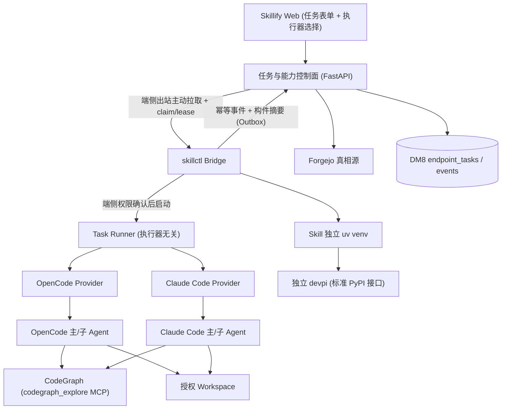

# Skillify Agent 架构收敛 · 实施计划（plan）

> 日期：2026-07-16
> 上游裁决：`docs/2026-07-16-skillify-agent-architecture-convergence-review-brief.md`
> 配套任务清单：`docs/2026-07-16-skillify-agent-architecture-convergence-task.md`
> 交付对象：Codex（后端/CLI/Provider）、GPT/Sonnet（逐 Task 执行）。本计划由 Opus 4.8 基于**源码级核实**产出。
> 状态：开发期改造已完成；基线全量测试按用户指示跳过，真实环境验收与系统级 hardening 待测试环境统一执行。所有文件路径为仓库相对路径（`+` = 新增）。

---

## 0. 源码核实评审结论（先读，含对 brief 的纠正）

三条方向裁决在源码层面**成立**，但 brief 对删除范围与耦合点有若干高估/低估，已用证据纠正。下表是本轮唯一权威的“现实基线”，覆盖 brief 与既有 `TASKS`/任务节点文档的任何冲突表述。

### 0.1 三域核实结论

| 域 | brief 判断 | 源码核实结论 | 证据 |
| --- | --- | --- | --- |
| Code Map | 删除自研前后端+CLI+MCP+解析存储 | **成立且删除更干净**：引擎仅依赖 stdlib + `rg` 子进程，`src/skillify/codemap/` 对其他 Skillify 模块**零依赖**，可整包删除 | `codemap/*` 内无 `skillify.web/mcp/agent/validator` 导入；反向仅 `cli/map_cmd.py`+测试引用 |
| Code Map 前端 | 删路由/菜单/store/api client/RBAC 菜单项/后端可视化 API | **多数不存在**：`CodeMapView.vue` 是**孤儿视图**（无路由、无菜单、无 store、无 api client 引用）；RBAC 菜单种子**无 Code Map 项**；**无任何后端可视化 API** | `web/src/router/*`、`infra/dm8-init/06-rbac-skillify-menus.sql` 无引用；`app.py` 无 map 路由 |
| devpi | 解耦而非替换 | **成立且改动更小**：运行期代码**已经**走标准 PyPI（`uv pip install --index-url`），`src/` 内**零** devpi 私有 API；耦合**只在 infra/脚本/doctor 严重度/运维文档** | `install/venv.py:41-51`、`config.py:138`；`docker-compose.yml:45-52,81-85`；`doctor_cmd.py:137-151` |
| 在线 Agent | pull/events/claim/lease 缺失、Bridge 不调 Provider、自研 Workflow 执行器重复 | **全部成立**，且额外发现**两套互不连通的任务存储** | `bridge_cmd.py:40,133-140`；`reporting.py:130`；`app.py:961,971`；`web_store.py` vs `tasks/protocol.py` |

### 0.2 对 brief 的具体纠正（Codex 必须以此为准）

1. **`§3.3` 后端可视化 API 与前端路由/菜单/RBAC 项均不存在**。Code Map 前端删除工作量 ≈ 删 1 个孤儿视图 + 1 段治理面板代码 + 2 个前端测试片段，而非整套路由/菜单迁移。
2. **`§3.3` manifest/schema 私有字段**：validator manifest schema (`src/skillify/validator/schemas/skill-manifest-v1.schema.json`) **无** Code Map 字段；唯一相关字段是 Web DTO `SkillGovernance.codeMapReferences`（`web/schemas.py:31`，展示透传）。
3. **`§3.1` 未接入 Tree-sitter/Ctags/Repomix**：确认属实（仅 `ast` + 正则降级）。这佐证“自研代码智能不宜作正式底座”的裁决。
4. **`§5.1` 补充发现**：Web 控制面用 SQLAlchemy `EndpointTaskRecord`（`tasks/web_store.py` + `index/models.py`），端侧协议用独立的 `TaskEnvelope`/`SQLiteTaskStore`（`tasks/protocol.py`，含签名/nonce/`state_version` compare-and-set/revoke），二者**未通过任何 HTTP 面连通**。补齐闭环的核心之一就是把协议层的签名/租约/幂等状态机**接到** DM8 `endpoint_tasks` 表上并暴露为 HTTP。
5. **`§5.3` 迁移边界**：`workflows/contract.py` 的 `execute_workflow` 串行角色循环、`WorkflowRole`、`WorkflowExecution` 属删除项；`WorkflowGate`、`approval_required`、`_safe_relative`、`_mapping`、`validate_skill_dir` 挂载、artifact 解析、`mode` 属**保留并迁移**项。

### 0.3 用户裁决（覆盖 brief 对应表述）

| 主题 | 用户裁决 | 对 brief 的影响 |
| --- | --- | --- |
| 交付文件 | 带日期的 `docs/` 文件（本文件与配套 task） | — |
| Code Map 切换时序 | **立即一刀切删除**，不保留 Legacy，不做双轨；当前处测试阶段无需担心冲突 | 覆盖 `§3.5`“门禁通过后才删”的时序：删除**不**被 test-env 门禁阻塞；CodeGraph Go/No-Go 降级为**并行接入 + 上线前验收**，不是删除前置 |
| 代码智能兜底 | **不做无意义兜底**；CodeGraph 不可用时退回**执行器自身原生** `grep/read`（OpenCode 与 Claude Code 都自带），不建 Skillify 侧兜底层 | 与 `§3.2` 一致；强化“不建第二套检索” |
| 在线执行器范围 | **OpenCode + Claude Code 双执行器**（Web→Bridge→任选执行器） | **覆盖 brief `§二`/`§5.2` 的“OpenCode first、Claude Code 延后”**：本轮并行建设 `ClaudeCodeProvider` 与其能力安装层 |

### 0.4 环境与基线诚实边界

- **`dmpython==2.5.32`（DM8 驱动）无 macOS wheel**（`pyproject.toml:20`，无平台 marker）→ 本 macOS 开发机**无法运行 `uv run pytest`**。所有 Dev-DoD 离线单测**以 Linux（Codex 环境）为准**。本轮不改该依赖形态（超出裁决范围），仅在验证命令中标注 Linux 前提。
- 沿用既有两层门禁：**Dev-DoD**（`compileall` + Linux 离线 `pytest` + 前端 `vue-tsc`/`vitest`/`build`）现在必须过；**[test-env]**（真实 OpenCode/Claude Code/DM8/Forgejo/devpi/内网模型/目标 Linux）延后销账。
- 既有任务节点 `docs/2026-07-16-endpoint-agent-tasks.md` 的 Dev 勾选“只代表编译通过+离线逻辑正确”，本计划不改写历史文档；**本轮真实完成度以配套 task.md 为准**（见 `§10`）。

---

## 1. 目标架构与边界



**边界（不变量）：**
- 服务端：能力分发、任务、身份（Keycloak/RBAC）、权限、端点绑定、审计、结果。**永不主动连端侧**，端侧出站领任务。
- Bridge：端侧领取/确认/安装/启动/取消/Outbox/补传/在线状态。
- Provider（两个，实现同一 `AgentProvider` 契约）：只做进程/会话/事件映射/取消/清理，**不实现**任务分解、角色循环、子 Agent 调度、上下文压缩、工具系统。
- CodeGraph：执行器共享的代码检索/调用链/影响面（MCP 工具，执行器无关）。不可用时退回执行器原生 `grep/read`。
- devpi：独立服务，Skillify 仅通过 index URL + 凭据/CA + 包名版本 + lockfile/checksum 消费。
- Forgejo：Skill 源码/Release/不可变构件。

---

## 2. Workstream A — Code Map → CodeGraph（立即一刀切）

### 2.1 删除清单（DELETE，整文件）
```
src/skillify/codemap/__init__.py
src/skillify/codemap/pipeline.py
src/skillify/codemap/schema.py
src/skillify/codemap/store.py
src/skillify/codemap/query.py
src/skillify/codemap/mcp_server.py
src/skillify/cli/map_cmd.py
web/src/views/CodeMapView.vue
tests/test_codemap_store.py
tests/test_codemap_pipeline.py
tests/test_codemap_interfaces.py
web/tests/codeMap.spec.js
```

### 2.2 外科编辑清单（MODIFY，只删归属行，保留文件）
```
src/skillify/cli/main.py            # 删除 line 32 `from skillify.cli.map_cmd import map_app` 与 line 35 `app.add_typer(map_app, name="map")`
src/skillify/web/schemas.py         # 删除 SkillGovernance.codeMapReferences 字段 (line 31)
src/skillify/web/service.py         # 删除 codeMapReferences 的取值/填充 (约 line 159, 183)
web/src/components/SkillGovernancePanel.vue   # 删除 line 27 的 <h3>Code Map</h3> ... governance.codeMapReferences 区块
web/tests/communityGovernance.spec.js         # 删除 codeMapReferences fixture + "Code Map" 断言
docs/mcp/catalog.md                 # 删除 Code Map / skillify-codemap 目录行 (line 10)
workflows/onboarding/{workflow.yaml,skill.yaml,project-brief.md,SKILL.md}   # 措辞：Code Map 证据 → CodeGraph 证据；移除 code-map tag
workflows/feature/workflow.yaml     # 措辞同上
workflows/bugfix/{workflow.yaml,bugfix-report.md}   # 措辞同上
```

### 2.3 CodeGraph 接入（CREATE/MODIFY，最薄生命周期）
```
+src/skillify/agent/codegraph.py          # 版本/兼容检查、离线安装校验、workspace 索引 init/update、生成 codegraph_explore MCP 配置、关遥测/禁公网、任务前索引状态检查、失败诊断
+infra/offline/codegraph-manifest.json    # 不可变构件元数据：version/platform/sha256/license（复用 infra/offline/opencode-manifest.json 的模式与校验逻辑）
 src/skillify/cli/doctor_cmd.py           # 新增 codegraph 检查项（版本/兼容/索引可用）；失败为可继续（agent 原生检索）
 src/skillify/agent/opencode_config.py    # 生成 OpenCode 的 codegraph_explore MCP 配置
+src/skillify/agent/claudecode_config.py   # 生成 Claude Code 的 codegraph_explore MCP 配置（.mcp.json）
+tests/test_codegraph_manifest.py          # 哈希比对/损坏包拒绝/版本解析（离线）
+tests/test_codegraph_config.py            # 两执行器 MCP 配置生成幂等/dry-run/冲突拒绝（临时目录离线）
+tests/test_codegraph_smoke.py             # [test-env] 真实 CodeGraph 安装+索引+codegraph_explore 调用（默认 pytest.mark.skip）
```

### 2.4 CodeGraph Go/No-Go（[test-env] 验收，不阻塞删除）
上线前必须在真实 Linux/CPU/glibc 完成（`§8`）：离线安装启动；Python/Vue/JS-TS/主力语言建索引；两执行器可调 `codegraph_explore`；改码后索引可更新；关遥测后无公网请求；固定构件可校验/升级/回滚。**未过前**在线任务的代码检索退回执行器原生 `grep/read`（无 Skillify 兜底）。

### 2.5 删除顺序（单 commit 完成一刀切，保证每步可编译）
1. 先删前端孤儿视图与治理面板区块 + 前端测试片段（前端独立可 `build`）。
2. 删 `cli/main.py` 两行 wiring → 删 `cli/map_cmd.py` → 删 `codemap/*` 包 → 删后端 codemap 测试（后端 `compileall` 保持过）。
3. 删 Web DTO 字段/填充 + 目录文档行 + workflow 措辞。
4. 单 commit：`refactor(codemap): remove self-built code map, adopt codegraph`。

---

## 3. Workstream B — devpi 解耦（infra-only，不动安装链代码）

### 3.1 保持不变（PRESERVE，禁止破坏）
`install/venv.py`（`ensure_venv`/`install_python_deps`）、`install/installer.py`、`install/extract.py`（checksum）、`install/lock.py`、`install/resolver.py`（`verify_locked_artifact`）、`install/dependencies.py`、`common/config.py:138`（`devpi_index_url` 保持 index URL 字符串语义）。这些已是标准 PyPI/uv 接口，**零改动**。

### 3.2 解耦改动（MODIFY/CREATE，仅部署/配置/严重度/文档）
```
 infra/docker-compose.yml            # 删除 devpi 服务(45-52)、skillify-web 的 depends_on: devpi(84-85)、devpi-data 卷(125)
+infra/devpi/docker-compose.yml       # 独立 devpi 栈（迁入现 infra/devpi/Dockerfile 的构建 + 自有卷/端口）
 infra/devpi/Dockerfile              # 迁入独立栈；Skillify 主栈不再构建 devpi
 scripts/deployment/start-test-server-docker.sh   # line 86 `start_and_wait skillify-devpi-1` → `optional_start_and_wait`
 tests/test_infra_compose.py         # 更新：不再要求 devpi 是 Skillify 服务/卷；断言主栈无 devpi 依赖
 src/skillify/cli/doctor_cmd.py      # devpi-reachable 检查降级为 required=False（WARN），不因 devpi 宕阻断非 Python 环境
+docs/operations-devpi-standalone.md  # 独立 devpi 备份/恢复/升级 runbook
 docs/operations-dm8-forgejo-devpi.md # 拆出 devpi 生命周期段落，改为“引用独立 runbook”，只保留 DM8/Forgejo
```

### 3.3 向后兼容
`SKILLIFY_DEVPI_INDEX_URL` 语义与默认值不变；主栈默认仍可指向外部/独立 devpi。开发者若仍想本地起 devpi，用新增独立 compose 单独 `up`。

---

## 4. Workstream C — 在线 Agent 真实闭环（删重复执行器 + 补齐 + 双执行器）

### 4.1 删除/迁移自研 Workflow 执行器
```
 src/skillify/workflows/contract.py   # DELETE: execute_workflow(:134-158)、WorkflowRole(:16-21)、WorkflowExecution(:42-47)、load 中角色解析(:81-93)与 execution=="serial" 约束(:74)
+src/skillify/workflows/pack_config.py # MIGRATE(保留价值): validate_skill_dir 挂载、_safe_relative、_mapping、WorkflowGate、approval_required、mode、artifact 解析 → Workflow Pack 配置模块（无运行时）
 tests/test_workflow_onboarding.py     # 改：不再驱动 execute_workflow；改测 pack 结构/门禁/artifact 声明解析
 tests/test_workflow_bugfix.py         # 同上
 tests/test_workflow_feature.py        # 同上（保留审批门禁开关逻辑测试）
```
Workflow Pack 新语义（配置，非 Runtime；`runtime` 支持 `opencode | claude-code`，`entry_agent`、`skills`、`gates`、`permissions`）见 brief `§5.4`。`skillctl` 只负责安装 Skill/Agent/Command/权限/CodeGraph MCP 配置到目标执行器；主 Agent 自行决定子 Agent。

### 4.2 补齐缺失的服务端在线 API（CREATE/MODIFY）
```
+src/skillify/web/endpoint_agent_api.py   # 新增端侧协议路由（用 @app 装饰器注册进 app.py，或在 app.py 内新增）：
    GET  /api/endpoint/tasks/pull            # 按 endpoint 领取 + claim + 发放 lease（state_version compare-and-set）
    POST /api/endpoint/tasks/{id}/heartbeat  # 续租
    POST /api/endpoint/tasks/{id}/confirm    # 端侧权限确认 → awaiting_approval→running 前置
    POST /api/endpoint/tasks/{id}/cancel     # 取消
    POST /api/endpoint/events                # 幂等事件入库（按 event_id 去重），写 EndpointTaskEventRecord
 src/skillify/web/app.py                  # 注册上述路由；沿用 require_keycloak_user / endpoint 归属校验
+src/skillify/tasks/lease.py              # 服务端 claim/lease/heartbeat/过期回收 纯逻辑（compare-and-set，可对 SQLite 离线单测）
 src/skillify/tasks/web_store.py          # dispatch_task 增加 runtime 字段；新增 pull/claim/lease/event 落库操作
 src/skillify/index/models.py             # EndpointTaskRecord 增 runtime/lease 列；EndpointTaskEventRecord 幂等约束
```

### 4.3 连通两套存储（关键）
- DM8 `endpoint_tasks` 表为**服务端唯一真相源**。
- 把 `tasks/protocol.py` 的 `TaskEnvelope`（签名/expires/nonce 重放保护）与状态机（compare-and-set/revoke）逻辑**应用到** DM8 记录上：pull 时下发签名 envelope，事件/状态回传时校验 nonce 与 `state_version`。
- `SQLiteTaskStore` 保留为**离线测试替身**，不作生产存储。

### 4.4 Bridge → Provider 打通（当前断点）
```
 src/skillify/cli/bridge_cmd.py       # pull → 端侧确认 → 交给 Task Runner；不再只写 task.received
+src/skillify/agent/runner.py         # 执行器无关 Task Runner：按 task.runtime 选 Provider，start/create_session/submit/stream_events→Outbox→幂等上传；复用 agent_cmd._run_local_task 逻辑
 src/skillify/cli/agent_cmd.py        # 抽出本地 run 的 provider 驱动为可复用（供 runner 与 `agent run` 共用）
 src/skillify/tasks/reporting.py      # 保持 /api/endpoint/events 目标；确认幂等 event_id 语义与服务端一致
```

### 4.5 双 Provider（OpenCode 保留 + Claude Code 新建）
```
 src/skillify/agent/providers/opencode.py   # 保留；补 session 恢复(resume) 以支持断线重连（brief §7）
+src/skillify/agent/providers/claudecode.py  # 新 Provider，实现同一 AgentProvider 契约：
    - 无头启动 `claude -p --output-format stream-json`（或 Agent SDK），仅 workspace + allowed_paths
    - 临时凭据/模型端点经 ModelRuntimeConfig 注入，不落盘
    - stream-json 事件 → 标准 TaskEvent（映射五条生命周期：正常/取消/超时/崩溃/SIGTERM）
    - 进程组清理，密钥不落盘/日志
+src/skillify/agent/claudecode_config.py     # 见 2.3：安装 Skill/MCP/agents/commands 到 Claude Code
+tests/test_claudecode_provider_contract.py  # fake claude 子进程离线验证映射与五条分支
+tests/test_claudecode_provider_smoke.py     # [test-env] 真实 Claude Code，默认 skip
 tests/test_provider_contract.py             # 复用 FakeProvider，双 Provider 共用契约
```

### 4.6 审批仍在控制面（brief §5.5）
执行前展示 workspace/Skill/MCP/文件/命令/网络权限；Plan 阶段只读 Agent；`plan.ready` 暂停；Web/端侧批准后进可写 Build；高风险工具端侧二次确认。审批状态机在**服务端 + Bridge 确认**，不在 Provider。

### 4.7 前端（MODIFY）
```
 web/src/views/EndpointTasksView.vue  # 任务表单增“执行器选择(OpenCode/Claude Code)”；展示真实阶段/测试摘要/diff 摘要/构件/失败原因/事件时间线
 web/src/lib/api.js                   # 端点任务 client 增执行器字段；事件时间线读取
```

---

## 5. 数据库迁移与向后兼容（expand → contract）

```
+infra/dm8-init/07-endpoint-task-runtime-lease.sql   # expand：endpoint_tasks 增 runtime、lease_owner、lease_expires_at、heartbeat_at；endpoint_task_events 增 event_id 唯一约束（幂等）
 infra/dm8-init/06-endpoint-tasks.sql                # 保持不变（已含 state_version/revoked/nonces）
```
- **先 expand 后 contract**：新列可空/带默认，旧记录不破坏；SQLite 测试库同步建表（离线单测）。
- 真实 DM8 方言兼容标 [test-env]。回滚：新迁移独立文件，回退即不加载 07。

---

## 6. TDD 顺序、验证命令与预期结果

> Linux/Codex 环境执行（本 macOS 机因 `dmpython` 无法跑 pytest，见 0.4）。

**Dev-DoD 工具箱：**
```
uv run python -m compileall -q src                       # 后端可编译（准入下限）
uv run pytest -q                                         # 后端离线单测（Fake/临时目录/SQLite）
cd web && npm run type-check && npm test && npm run build # 前端 vue-tsc / vitest / 打包
```

**TDD 总顺序（每阶段先写失败离线单测 → 实现 → 过 Dev-DoD → commit）：**
1. **A 删除**：先跑基线 `pytest` 记录绿；删 codemap 后 `compileall` + `pytest` 仍绿（删掉的测试一并移除）；`web build` 绿。
2. **A CodeGraph 接入**：`test_codegraph_manifest.py`/`test_codegraph_config.py` 先红后绿；`test_codegraph_smoke.py` 标 skip。
3. **B devpi**：`test_infra_compose.py` 改断言先红后绿；`test_cli_doctor.py` 断言 devpi 为 WARN 不阻断。
4. **C 存储/协议**：`tasks/lease.py` 的 claim/lease/heartbeat/过期 对 SQLite 全覆盖；两存储连通的 envelope 签名/nonce/compare-and-set 幂等。
5. **C 服务端 API**：pull/events/confirm/cancel/heartbeat 对 fake Keycloak + SQLite 离线契约测试（重复 pull、重复 event、越权 endpoint、lease 过期）。
6. **C Bridge→Runner→Provider**：FakeProvider 驱动全链路事件序列 → Outbox → 幂等上传；断网补传去重。
7. **C ClaudeCodeProvider**：fake 子进程契约测试，五条生命周期；与 OpenCode 共用 `test_provider_contract.py`。
8. **C 前端**：EndpointTasksView 执行器选择/事件时间线对 fake 数据 `vitest` 渲染。

**预期结果**：每阶段 `compileall` 退出 0；相关 `pytest` 全绿（[test-env] 用例 skip）；前端三命令绿。任一阶段红则不推进下阶段（见 task Gate）。

---

## 7. 每阶段回滚

- **A**：单 commit 删除；回滚 = `git revert` 该 commit（codemap 引擎无外部状态，安全）。CodeGraph 接入为独立 commit，可单独回退，回退后代码智能退回执行器原生检索。
- **B**：infra/文档/severity 改动为独立 commit；回滚即恢复 devpi 进主栈 compose。
- **C**：按 4.1→4.7 拆多 commit，每 commit 独立可编译可离线单测；新增路由/Provider/迁移均可单独 revert；DB 迁移 07 独立文件，回退不加载。

---

## 8. 真实 Linux/内网验收（[test-env] 门禁，接入后销账）

1. **CodeGraph Go/No-Go**（`§2.4`）：离线安装/建索引/两执行器调用/增量更新/关遥测无公网/构件可校验升级回滚。
2. **在线闭环 E2E**：Web 建任务（选 OpenCode 或 Claude Code）→ 指定端侧 pull+claim+lease → 端侧确认 → Provider 启动执行器 → 改码+跑测 → SSE/stream-json→TaskEvent → Outbox 幂等上传 → Web 展示真实阶段/测试摘要/diff/构件。
3. **必须覆盖分支**：正常完成 / 用户拒绝 / 等待计划审批 / 用户取消 / 执行器异常退出 / 网络中断后补传 / 重复 pull+重复事件 / lease 过期 / workspace 越权 / CodeGraph/devpi 不可用时明确降级或阻塞。
4. **信任边界**：服务端从未连端侧入站端口；OpenCode/Claude Code 仅绑 `127.0.0.1`；停止后无残留进程；devpi 作为独立服务经 index URL 接入。

---

## 9. 明确不做（Non-Goals）

- 不引入 GitNexus/GitDiagram/Understand Anything/iframe Code Map 页面；不新建 Skillify Code Map Web 页；不做 CodeGraph→其他图项目的 Schema 转换层；不为美观维护第二套代码图。
- 不迁移 Forgejo PyPI/Nexus/Pulp；不由 Skillify 管理 devpi 用户/index/数据目录/升级/备份。
- 不引入 LangGraph/CrewAI/AutoGen/Flowise/Langflow/Temporal；不在 Provider 内实现任务分解/角色循环/子 Agent 调度/上下文压缩/工具系统。
- 不建服务器代码沙箱/容器执行集群/远程桌面；服务端不主动连端侧。
- 不 fork/改上游 OpenCode 或 Claude Code 源码。
- 不做 CodeGraph 与旧 Code Map 的 A/B 或双轨；不保留 Legacy feature flag。
- **不做无意义兜底**：CodeGraph 不可用即用执行器原生检索，不建 Skillify 侧检索兜底层。

---

## 10. 既有任务状态修正（brief §8）

以下既有勾选**不代表目标已达成**，本轮以配套 task.md 为真实源；不改写历史文档，仅在此登记纠正：

| 既有条目 | 既有状态 | 本轮修正 |
| --- | --- | --- |
| S3 Task 3.1–3.3 Code Map | Dev-DoD ✅ | **作废**：自研 Code Map 整体删除，改 CodeGraph；原实现不再是目标底座 |
| S4 Task 4.1–4.4 Workflow Packs | Dev-DoD ✅ | **部分作废**：自研串行执行器删除；Pack 降级为 OpenCode/Claude Code 配置；FakeProvider golden 不证明真实执行 |
| S5.2 Bridge | Dev-DoD ✅ | **不完整**：Bridge 仅写 `task.received`，从不调用 Provider；pull/events 服务端路由**从未实现** |
| S5.4 Web 下达 | Dev-DoD ✅ | **不完整**：仅 `/api/endpoint-tasks` create/list；缺 pull/events/claim/lease/heartbeat/confirm/cancel |
| `/api/skills/.../orchestration` | 视为编排能力 | **纠正**：仅 manifest 元数据读取，无编排引擎（源码 docstring 已自述） |
| 所有 [test-env] G1–G8 | 未勾选 | 维持未勾选；真实闭环验收见 `§8` |

> 推进规则：任一阶段 Gate（见 task.md）未过，禁止推进下一阶段；[test-env] 未销账前不得宣称该域“上线可用”。
