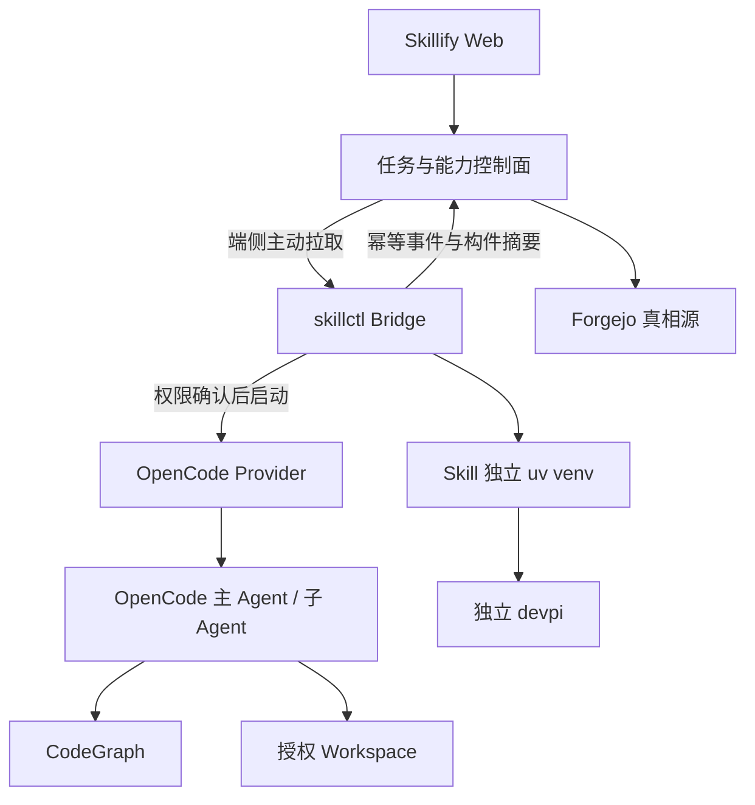

# Skillify Agent 架构收敛裁决与二次评审输入

> 日期：2026-07-16  
> 用途：交付 Claude Opus 阅读真实仓库、复核本裁决，并生成新的 `plan.md` 与 `task.md`，之后交给 Codex 修正和继续开发。  
> 本文是架构裁决和评审输入，不代表代码已经实现，也不允许根据任务勾选状态推断功能已完成。

## 一、结论先行

Skillify 后续必须守住三个边界：

1. **代码智能：** 删除 Skillify 自研 Code Map 前后端，单向切换到外部 CodeGraph，仅服务 Agent 精准检索、调用链和影响分析；取消所有 Code Map Web 可视化，不为美观维护第二套代码图系统。
2. **Python 私域：** 继续使用已经通过真实环境验证的 devpi，不切换 Forgejo PyPI、Nexus、Pulp 或其他项目；只把 devpi 从 Skillify 产品生命周期中解耦，通过标准 PyPI 接口使用。
3. **在线 Agent：** Skillify 自研任务控制面和端侧通信，OpenCode 负责 Agent Loop、主/子 Agent、代码工具和具体执行；删除与 OpenCode 重复的自研 Workflow 角色执行器，补齐 Web 下发到端侧执行再回传的真实闭环。

核心原则：

> 市面成熟项目覆盖的能力直接复用；只有 Skillify 特有的身份、分发、任务、端点、权限和审计边界才自研。不能为了“用了开源项目”盲目引入第二套运行时，也不能为了页面美观牺牲核心功能。

---

## 二、已确认的产品底座与不可破坏约束

- Forgejo 继续作为 Skill 源码、Release、不可变构件、checksum、manifest 和审计历史的真相源。
- 每个 Skill 独立 `uv` venv 的隔离方式保持不变。
- devpi 继续提供 Python 私有包、缓存/索引和离线依赖能力。
- Keycloak 与现有 .NET RBAC 继续负责身份和权限，不在 Agent 模块自建第二套用户系统。
- 目标端侧是 Linux；Agent 在用户电脑本地执行。
- 第一阶段不建设服务器代码沙箱、容器执行集群或远程桌面。
- 服务端不得主动连接用户电脑；端侧 Bridge 主动通过出站连接领取任务。
- OpenCode 使用官方二进制，不 fork、不修改上游源码。
- 第一执行器只收敛 OpenCode；Claude Code 仅保留未来 Provider 扩展边界，不并行开发。
- 原生文件、Shell、Git、测试和 LSP 能力由 OpenCode 提供，不强制包装成 MCP。

---

## 三、Code Map 最终裁决

### 3.1 当前实现问题

根据当前核实信息，Skillify Code Map 主要是自研最小实现：

- 文件发现仅复用 `ripgrep`，缺失时使用 `pathlib`；
- Python 使用标准库 `ast`；
- JS/TS/Java/Go 使用自研正则降级解析；
- Schema、增量存储、查询、CLI、MCP 均由 Skillify 自研；
- 前端使用原生 Vue 自研展示；
- 原计划要求的 Tree-sitter、Universal Ctags、Repomix 尚未接入。

这套实现可以证明产品链路，但不适合继续作为正式代码智能底座。多语言正则解析、调用关系、增量索引和 Agent 上下文构建会形成长期维护负担。

### 3.2 最终决定

- 采用 `colbymchenry/codegraph` 作为唯一端侧代码智能引擎。
- 不 fork CodeGraph，不复制其源码进入 Skillify，不使用 Git submodule。
- 通过内网不可变构件分发固定版本的 CodeGraph，记录版本、平台、SHA256 和许可证。
- CodeGraph 索引保存在端侧项目目录或其标准本地位置，Skillify 服务端不保存完整图数据。
- OpenCode 直接使用 CodeGraph 默认的单一 MCP 工具 `codegraph_explore`。
- Skillify 不再维护自研 Code Map MCP、图 Schema 转换器或多语言解析器。
- CodeGraph 不可用时，OpenCode 降级使用自身原生 `grep/read`，不回退到 Skillify Legacy Code Map。

### 3.3 完整移除范围

Claude Opus 必须根据真实引用关系找全删除范围，不得只删除两个入口文件。至少核实：

- `src/skillify/codemap/` 下的自研解析、Schema、存储、查询和增量逻辑；
- Code Map 自研 CLI 命令及注册入口；
- Code Map 自研 MCP Server、工具定义和配置；
- 仅为 Code Map 可视化服务的后端 API；
- `web/src/views/CodeMapView.vue`；
- 前端 Code Map 路由、菜单、store、API client、组件和样式；
- 对应单元测试、集成测试、快照、文档和构建依赖；
- 动态 RBAC 菜单中的 Code Map 项；
- manifest/schema 中仅为旧 Code Map 私有实现存在的字段。

如果某个通用 DTO、CLI 基础类或 MCP 基础设施还被其他模块使用，不得连带删除。

### 3.4 CodeGraph 必要接入范围

Skillify 只保留最薄的生命周期集成：

- `skillctl agent doctor` 检查 CodeGraph 版本与兼容性；
- 离线安装固定版本 CodeGraph；
- 在 workspace 初始化/更新 CodeGraph 索引；
- 为 OpenCode 生成 CodeGraph MCP 配置；
- 关闭遥测并禁止运行时公网访问；
- 任务启动前检查索引状态；
- 索引失败时输出清晰诊断，并让 OpenCode 使用原生检索继续工作。

### 3.5 不做 A/B，但必须有切换门禁

不再做 CodeGraph 与旧自研 Code Map 的性能、Token 或准确率 A/B，不保留双轨运行，避免增加切割成本。

但单向删除前必须完成最小 Go/No-Go：

- 目标 Linux/CPU/glibc 可离线安装和启动；
- Python、Vue、JS/TS 以及真实主力语言可以建立索引；
- OpenCode 可以调用 `codegraph_explore`；
- 修改代码后索引能够更新；
- 关闭遥测后不存在公网请求；
- 固定版本构件可校验、升级和回滚。

门禁通过后立即单向切换并删除旧实现，不保留 Legacy feature flag。

### 3.6 明确不做

- 不引入 GitNexus、GitDiagram、Understand Anything 或 iframe Code Map 页面。
- 不开发新的 Skillify Code Map Web 页面。
- 不维护 CodeGraph 到其他图形项目的 Schema 转换层。
- 不为了美观同时维护人类可视化图与 Agent 检索图。

---

## 四、Python 私域最终裁决

### 4.1 保留 devpi

devpi 当前已经满足并通过真实环境验证：

- Python 私有包；
- 内网离线依赖；
- pip/uv 可用索引；
- 缓存与 index 能力；
- 与每 Skill 独立 venv 配合；
- 当前创建、安装和测试链路。

Forgejo PyPI 虽然有包页面、`pip install` 和 `twine upload`，但主要是 hosted registry，无法证明可以完整替代 devpi 的代理缓存、索引继承和 Python 专用工作流。Nexus/Pulp 等方案则会引入许可、容量或运维复杂度。

因此本阶段不替换 devpi。外部方案只有在离线依赖完整性、功能、许可证、运维和迁移风险整体优于 devpi 时才重新评估。

### 4.2 解耦而不是替换

目标结构：

```text
独立 Python Package Infrastructure
└── devpi

Skillify
└── 通过标准 PyPI 接口使用 devpi
```

Skillify 只关心：

- index URL；
- credential/CA 引用；
- 包名和版本；
- lockfile 与 checksum；
- Python/平台兼容；
- 安装、升级、回滚和审计结果。

Skillify 不负责：

- devpi 用户和 index 的日常管理；
- devpi 数据目录；
- devpi 服务升级；
- devpi 备份恢复；
- 通用 Python 包审批平台；
- devpi Web 页面套壳。

### 4.3 评审要求

Claude Opus 必须检查当前 devpi 耦合点，包括但不限于：

- Compose/Dockerfile/启动脚本是否把 devpi 当成 Skillify 必需子进程；
- 配置是否硬编码 devpi 地址、账号或 index；
- CLI 与后端是否直接依赖 devpi 私有 API，而不是 PyPI 标准接口；
- 测试是否可以使用外部 devpi URL；
- devpi 故障是否会错误阻断与 Python 无关的 Skill；
- 备份恢复文档是否把 devpi 与 Skillify 数据库混成同一生命周期。

解耦不得破坏现有真实环境测试通过的安装链路。

---

## 五、在线 Agent 编排最终裁决

### 5.1 当前核实状态

当前属于“OpenCode 执行器 + Skillify 自研控制层”的混合架构：

| 层级 | 当前来源 | 最终裁决 |
| --- | --- | --- |
| Agent Loop、文件/Shell/Git/测试 | OpenCode | 保留复用 |
| OpenCode 启停、HTTP/SSE 转换 | Skillify Provider Adapter | 保留，但必须足够薄 |
| Workflow YAML、角色串行执行 | Skillify 自研 | 删除自研运行时，改由 OpenCode Agent/Skill 执行 |
| Web 任务、Endpoint 绑定、记录 | Skillify 自研 | 保留并补齐 |
| 端侧拉取、重试、Outbox | Skillify 自研 | 保留并补齐 |
| LangGraph/CrewAI/AutoGen | 未引入 | 继续不引入 |

当前在线链路据核实尚未完整串通：

- Web 已有 `/api/endpoint-tasks` 创建和查看接口；
- Bridge 请求 `/api/endpoint/tasks/pull`，服务端未实现；
- Bridge 向 `/api/endpoint/events` 上报，服务端未实现；
- Bridge 拉到任务后只写 `task.received` Outbox，没有调用 OpenCode；
- 自研 Workflow 执行器主要由 FakeProvider 离线测试调用；
- `/api/skills/.../orchestration` 只是 manifest 元数据读取，并非执行引擎。

Claude Opus 必须逐项读取真实代码确认，不能直接相信本文引用，也不能因为 Task 已勾选就判定完成。

### 5.2 保留的 Skillify 核心

#### Web 任务控制面

- 任务创建和查询；
- 用户与 Endpoint 绑定；
- RBAC；
- workspace alias；
- Workflow Pack 版本；
- 权限申请与审批；
- 任务状态、事件和审计；
- 结果、测试摘要和构件引用。

#### 端侧任务协议

- Bridge 主动拉取；
- claim/lease/heartbeat；
- 过期与取消；
- 幂等和重放保护；
- 用户端侧确认；
- 断线恢复与本地 Outbox；
- 事件补传；
- Endpoint 在线状态。

#### OpenCode Provider Adapter

只负责：

- 启动/停止 `opencode serve`；
- localhost、端口和临时凭据；
- 创建/恢复 Session；
- 提交任务；
- 消费 HTTP/SSE；
- 映射标准 TaskEvent；
- 取消与进程清理。

不得在 Provider Adapter 内实现任务分解、角色循环、子 Agent 调度、上下文压缩或工具系统。

### 5.3 删除的重复编排层

删除或重构 `src/skillify/workflows/contract.py` 及相关模块中负责以下行为的代码：

- Skillify 自己循环调用多个角色；
- 将一个角色输出转交下一个角色；
- Skillify 决定何时创建子 Agent；
- 解释通用 Workflow YAML 并实现 Agent 状态机；
- 与 OpenCode 重复的重试、工具和会话控制。

若其中存在通用 manifest 校验、权限声明或构件解析，可保留并迁移到 Workflow Pack 配置模块，不得因删除执行器误删通用能力。

### 5.4 Workflow Pack 新定位

Workflow Pack 是 OpenCode 执行配置，不是 Skillify 自研 Agent Runtime。建议语义：

```yaml
name: bugfix
version: 1.0.0
runtime: opencode
entry_agent: build

skills:
  - systematic-debugging
  - test-driven-development
  - verification-before-completion
  - requesting-code-review

gates:
  - local_permission
  - plan_approval

permissions:
  filesystem: workspace
  network: deny
```

Skillify/skillctl 负责安装这些 Skill、Agent、Command 和权限配置；OpenCode 主 Agent 决定是否以及如何调用子 Agent。

### 5.5 审批仍由 Skillify 控制

删除 Workflow 执行器不等于删除审批：

- 执行前展示 workspace、Skill、MCP、文件、命令和网络权限；
- Plan 阶段使用只读 Agent；
- 产生 `plan.ready` 后暂停；
- Web 或端侧批准后进入可写 Build 阶段；
- 高风险工具请求仍需端侧二次确认。

审批是控制面，不是 Agent Loop。

### 5.6 不引入第二套 Agent Runtime

本阶段明确不引入：

- LangGraph；
- CrewAI；
- AutoGen；
- Flowise；
- Langflow；
- Temporal。

理由：LangGraph/CrewAI/AutoGen 会与 OpenCode 重复 Agent 状态、角色和工具系统；Flowise/Langflow 偏服务器运行时，与本地 OpenCode 架构冲突；Temporal 当前会增加不必要的服务与 Worker 运维。未来只有在大规模端点、跨天恢复、多机器协同和现有任务表/Outbox 无法维护时才重新评估 Temporal。

---

## 六、目标架构



边界说明：

- Skillify 服务端：能力分发、任务、身份、权限、端点、审计和结果。
- skillctl Bridge：端侧领取、确认、安装、启动、取消、Outbox 和补传。
- OpenCode：Agent Loop、主/子 Agent、代码工具和会话。
- CodeGraph：Agent 代码检索、调用链和影响范围。
- devpi：Python 私有包和离线依赖。
- Forgejo：Skill 源码、Release 和不可变构件。

---

## 七、必须实现的真实在线闭环

目标流程：

```text
Web 创建任务
→ 服务端保存并绑定 Endpoint/workspace alias
→ Bridge 主动 pull 并获得 lease
→ 端侧展示权限并确认
→ Bridge 准备锁定 Workflow/Skill/CodeGraph
→ Provider 启动 OpenCode Session
→ OpenCode 主 Agent 按 Skills 调度子 Agent
→ 修改代码并运行测试
→ SSE 转换为标准 TaskEvent
→ Bridge 先写 Outbox
→ 幂等上传服务端
→ Web 展示阶段、测试摘要、diff 摘要和结果
```

至少需要覆盖：

- 正常完成；
- 用户拒绝；
- 等待计划审批；
- 用户取消；
- OpenCode 异常退出；
- 网络中断后补传；
- 重复 pull/重复事件；
- task lease 过期；
- workspace 越权；
- Skill/CodeGraph/devpi 不可用时的明确降级或阻塞。

---

## 八、任务状态修正规则

Claude Opus 必须重新审计现有 `TASKS`/计划文档：

- FakeProvider 单元测试通过不等于真实 OpenCode 集成完成；
- 路由客户端已经调用不等于服务端接口存在；
- Outbox 写入 `task.received` 不等于任务已经执行；
- manifest 能返回 `orchestration` 不等于编排引擎存在；
- 页面能创建任务不等于端侧闭环完成；
- Code Map 页面能展示不等于 Agent 代码智能达标；
- 代码存在不等于目标 Linux/内网真实环境可用。

所有不满足真实链路的完成项必须取消勾选，拆成可验证任务。

---

## 九、Claude Opus 评审任务

### 9.1 工作方式

1. 完整阅读根目录 `README`、`PLAN`、`TASKS`、`AGENTS.md` 和既有评审/测试文档。
2. 使用真实源码核对本文每一项陈述。
3. 使用 `rg` 找出 Code Map、devpi、Workflow、Bridge、Endpoint Task、Provider、Outbox 的完整引用关系。
4. 运行现有 lint、类型检查、单元测试和相关集成测试，记录修改前基线。
5. 不直接开发功能，不删除代码。
6. 输出评审报告、新 `plan.md` 和新 `task.md` 后停止，等待用户交给 Codex 二次修正。

### 9.2 必须回答的问题

- Code Map 自研实现的完整文件和依赖范围是什么？
- 删除 Code Map Web 后会影响哪些动态路由、RBAC 菜单和后端接口？
- CodeGraph 离线分发应该复用现有哪套不可变构件/安装/lockfile 机制？
- 当前 devpi 与 Skillify 的真实耦合点有哪些？哪些只需配置化，哪些必须重构？
- `/api/endpoint/tasks/pull`、`/api/endpoint/events` 以及 claim/lease/heartbeat 是否确实缺失？
- Bridge 从任务领取到 OpenCode Provider 的哪一步中断？
- `workflows/contract.py` 中哪些代码与 OpenCode 重复，哪些 manifest/权限逻辑仍有价值？
- OpenCode 现有 Provider 是否正确处理 localhost、临时凭据、SSE、取消和异常清理？
- 当前 Task 文档有哪些错误勾选或完成证据不足？
- 最小修正后能否完成一次真实 Linux Web → Bridge → OpenCode → Web E2E？

### 9.3 `plan.md` 必须包含

- 真实文件地图：Create/Modify/Delete/Test 精确到仓库相对路径；
- 架构边界与数据流；
- CodeGraph 单向切换和旧 Code Map 完整删除顺序；
- devpi 解耦但不替换的配置与部署修改；
- 自研 Workflow Runtime 删除/迁移顺序；
- 缺失在线 API、Bridge、Provider 和事件链路；
- 数据库迁移和向后兼容；
- TDD 顺序、精确测试命令和预期结果；
- 每阶段回滚方式；
- 真实 Linux/内网验收方案；
- 明确不做项。

### 9.4 `task.md` 必须包含

- 每个 Task 的前置依赖；
- 具体文件；
- 失败测试；
- 最小实现；
- 单元/集成/E2E 验证；
- 删除项；
- 完成证据；
- commit 边界；
- 阶段 Gate；
- 未通过 Gate 时禁止推进的条件。

不得使用：

- “后续完善”；
- “适当处理”；
- “添加必要测试”；
- “类似上一任务”；
- 没有文件路径和验证命令的笼统任务。

---

## 十、建议交给 Claude Opus 的开场指令

```text
请先完整阅读仓库根目录 README、PLAN、TASKS、AGENTS.md、所有现有评审与测试文档，并重点阅读
docs/reviews/2026-07-16-skillify-agent-architecture-convergence-review-brief.md。

本轮只做源码级二次评审和计划修正，不开发功能、不删除代码。不要相信现有 Task 的勾选状态，必须逐项以
真实源码、路由、调用链、测试和 Linux/内网证据核实完成度。

请重点完成三项复核：
1. Code Map：采用 CodeGraph 单向替换，取消 Web 可视化，完整删除 Skillify 自研 Code Map 前后端、CLI、
   MCP 和解析存储，不保留 Legacy；不做 A/B，只保留切换前兼容性门禁。
2. Python 私域：继续使用 devpi，只做部署和配置边界解耦，不迁移 Forgejo PyPI/Nexus/Pulp，不破坏现有
   每 Skill 独立 uv venv、lockfile、checksum 和离线安装。
3. 在线 Agent：Skillify 保留任务控制面、Endpoint、Bridge、权限、Outbox 和事件审计；OpenCode 负责 Agent
   Loop、主/子 Agent 和代码执行；删除与 OpenCode 重复的自研 Workflow 角色执行器，并补齐 Web 下发 →
   Bridge 领取/确认 → OpenCode 执行 → 事件补传 → Web 展示的真实闭环。

输出：
- 一份源码核实评审报告；
- 根目录或项目既定文档目录中的 plan.md；
- 根目录或项目既定文档目录中的 task.md。

plan/task 必须使用真实仓库相对路径、TDD 步骤、验证命令、预期结果、删除清单、commit 边界和阶段 Gate。
发现本文判断与源码不符时，必须给出证据并纠正，而不是机械执行。完成文档后停止，等待交付 Codex 评审。
```

---

## 十一、最终验收定义

本轮后续开发最终成功必须同时满足：

1. Skillify 不再包含自研 Code Map Web、解析器、图存储和重复 MCP。
2. CodeGraph 成为唯一端侧代码智能引擎，OpenCode 能使用它并在失败时降级原生检索。
3. devpi 保持现有能力，但可作为独立服务通过标准配置接入。
4. Skillify 不再自行执行角色串行 Agent Workflow。
5. OpenCode 负责主/子 Agent 与代码执行。
6. Web 创建的任务可以被指定端侧主动领取、确认并真实执行。
7. 网络中断后事件能够幂等补传，任务不会重复执行。
8. Web 能显示真实阶段、测试结果和构件摘要，不显示虚构进度。
9. 全链路在目标 Linux 和内网模型/Forgejo/devpi 环境完成真实验证。

