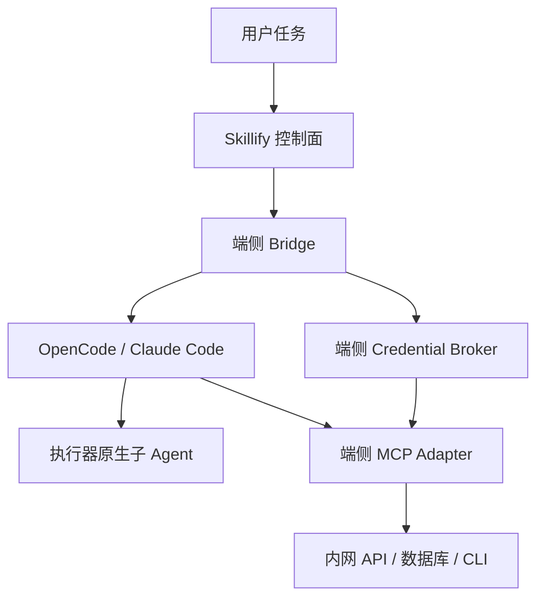
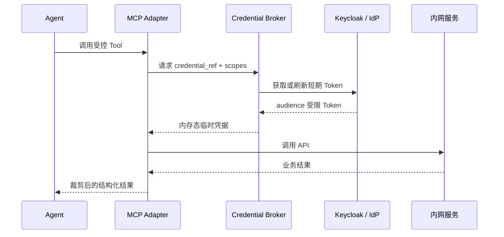

# Skillify 端侧 MCP 与主子 Agent 委派设计裁决

> 日期：2026-07-16  
> 文档性质：架构设计输入与二次评审约束  
> 下游用途：交由 Claude Opus 基于 Skillify 真实源码生成 `plan.md` 与 `task.md`，再由 Codex 二次评定并实施  
> 前提：当前处于独立编码环境，用户已明确允许跳过全量基线与真实内网环境验收；实现状态与上线验收状态必须分开标记。

---

## 1. 本轮最终裁决

本轮新增两项架构裁决：

1. **MCP 采用端侧优先架构。** OpenCode、Claude Code 与本地 MCP Adapter 运行在用户 Linux 电脑上，由 Adapter 访问端侧可达的内网 API、数据库、CLI、文件或消息系统。Skillify 服务端不承担通用 MCP Runtime，也不建设服务器沙箱。
2. **主子 Agent 委派以执行器原生能力为准。** Skillify 提供拆分建议、工作包编辑、权限与审批；用户确认后，由 OpenCode 或 Claude Code 的原生主 Agent 决定并执行子 Agent 调度。不得恢复 Skillify 自研角色循环、提示词接力或子 Agent 消息总线。

MCP 与 Agent 的目标关系：



---

## 2. MCP 在 Skillify 中的正式定位

MCP 不是“把数据库暴露给用户”，也不是 Skillify 的新业务编排引擎。其正式定位是：

> **面向内网 Agent 的标准工具接入协议。Skillify 负责 MCP 构件目录、离线分发、权限、凭据引用、执行器配置和审计；成熟 MCP Server 或薄 Adapter 负责把已有系统的受控能力提供给 OpenCode/Claude Code。**

### 2.1 Skillify 应当负责

- MCP Package 的坐标、版本、许可证、SHA256 与 Forgejo Release；
- 离线安装、升级、回滚、兼容矩阵；
- OpenCode `opencode.json` 与 Claude Code `.mcp.json` 的薄配置适配；
- MCP 所需网络目标、命令、目录、凭据引用和 Scope 声明；
- 用户、端点、Workflow Pack 与 MCP Package 的授权关系；
- 安装预览、调用前风险确认、事件与审计；
- 按任务启用最小工具集合，避免上下文膨胀；
- 外部开源 MCP Server 的引入、验证和内网镜像；
- 内部老系统 Adapter 的模板、测试契约和治理标准。

### 2.2 Skillify 不应当负责

- 手写 MCP JSON-RPC、stdio、SSE 或 Streamable HTTP 协议栈；
- 自研通用 MCP Server Runtime；
- 为了统一而代理所有 MCP 流量；
- 把所有 MCP 工具一次性注入每个 Agent；
- 替代老系统原有权限和业务校验；
- 在 MCP Adapter 内实现 Agent 推理或复杂业务工作流；
- 第一阶段引入 ContextForge、ToolHive 等与 Skillify 治理面高度重叠的平台；
- 要求老系统团队理解或原生实现 MCP。

### 2.3 协议实现裁决

- 删除当前手写的 `subprocess + select + JSON-RPC` MCP 探测客户端；
- 使用官方 MCP Python SDK 的稳定 v1 生产线，并在离线制品中固定精确版本和哈希；
- SDK 负责协议协商、stdio 生命周期、`initialize`、`tools/list`、`tools/call`、错误与取消；
- v2 在正式稳定并通过内网兼容验证前不得进入生产版本；
- CodeGraph 继续直接使用其现成 MCP Server，Skillify 只做生命周期与配置集成。

---

## 3. 端侧 MCP Adapter 架构

### 3.1 为什么端侧优先

- 用户电脑通常已经能够访问业务 API 的受限端口，Skillify 服务端未必处于同一网络区域；
- 用户身份、Kerberos 票据、客户端证书或老系统 Token 可能只存在于端侧；
- 凭据无需上传 Skillify 服务端；
- stdio MCP 不需要额外监听端口；
- Adapter 进程可限制在当前任务、当前用户和当前工作区生命周期内；
- 符合第一阶段“不建设服务器沙箱”的裁决。

### 3.2 老系统不需要支持 MCP

Adapter 可以包装老系统已有的稳定接口，优先级如下：

| 老系统能力 | Adapter 方式 | 结论 |
|---|---|---|
| REST/OpenAPI | MCP Tool 调用 API | 首选 |
| 已有 CLI | 包装受控 CLI 子命令 | 推荐 |
| 数据库只读账号 | 受限查询工具 | 谨慎采用 |
| SOAP/WebService | 转换请求与错误 | 可采用 |
| 消息队列 | 发布/查询受控消息 | 按业务采用 |
| 文件导入导出 | 约定目录与格式 | 次选 |
| 只能操作网页 | 浏览器自动化 | 最后选择 |
| 无稳定机器接口 | 要求系统方提供最小 API/数据出口 | 不得绕过 |

### 3.3 Adapter 必须保持薄

允许实现：

- MCP 参数到 API/CLI/SQL 参数的转换；
- 调用原有系统；
- Credential Broker 获取短期凭据；
- Scope、字段、行数、超时、网络目标和只读策略校验；
- 输出裁剪、脱敏、结构化错误与审计事件。

禁止实现：

- 固定多角色业务流程；
- Agent Loop；
- 长时间任务调度器；
- 替代老系统事务与审批；
- 万能 `execute_anything`、`execute_any_sql`、`legacy_system_call`；
- 任意目标 URL、任意 Shell 或任意 SQL。

### 3.4 Tool 应当原子化并区分读写

示例：

```text
ticket.read
ticket.search
ticket.comment
ticket.create
ticket.close
```

默认策略：

| 操作 | 默认控制 |
|---|---|
| 查询、描述 Schema | 用户授权后可自动调用 |
| 生成草稿 | 自动或一次确认 |
| 新建正式记录 | 调用前确认 |
| 修改业务数据 | 强制确认并展示参数 |
| 删除、关闭、发布 | 强制确认、审计，必要时禁止 |

### 3.5 不做全量工具注入

MCP 必须按任务动态启用：

| 任务 | 建议工具 |
|---|---|
| 普通代码开发 | CodeGraph |
| 数据库故障排查 | CodeGraph + DM8 Readonly |
| CI 故障 | CodeGraph + Forgejo |
| 文档分析 | 文档搜索 |
| 本地文本批处理 | 优先 Skill/CLI，不启用 MCP |

每个 MCP Package 必须声明工具摘要和上下文预算；Workflow Pack 只能启用任务所需的 MCP，不得把社区全部 MCP 注入执行器。

---

## 4. 身份与令牌前置条件设计

### 4.1 核心原则

1. **服务端不随任务下发明文 Token、Refresh Token、Client Secret 或数据库密码。**
2. 服务端只下发 `auth_profile` 与 `credential_ref`，不下发秘密本身。
3. Token 由端侧 Credential Broker 在用户确认后获取、刷新、缓存和注入。
4. Web 用户身份、Endpoint 机器身份、业务 API 调用身份必须分离。
5. 每个 Token 必须限制 audience、scope、有效期和目标系统。
6. 凭据不得进入任务 YAML、MCP 配置、命令行参数、Git、日志、事件或 Agent 上下文。
7. 写操作除身份授权外，还必须经过 Skillify 权限和用户确认；“拿到 Token”不代表允许 Agent 自动执行。

### 4.2 四类身份不可混用

| 身份 | 用途 | 推荐认证方式 |
|---|---|---|
| Web 用户身份 | 创建、审批、查看任务 | Keycloak OIDC 用户 Token |
| Endpoint 机器身份 | Bridge 拉取任务、心跳、上报事件 | 独立 Endpoint 凭据、mTLS 或短期设备 Token |
| 用户委托业务身份 | 以当前用户权限调用内网 API | OIDC Authorization Code + PKCE、Device Authorization 或 Token Exchange |
| 服务账号身份 | 无人值守或共享只读能力 | Client Credentials，最小角色与 Scope |

禁止使用一个 Keycloak Web Token 同时承担上述四种身份。

### 4.3 端侧 Credential Broker

在 Bridge 内增加本地凭据代理，但不做新的集中秘密平台：



Credential Broker 的职责：

- 解析 `auth_profile`；
- 检查用户是否已批准本次 Scope；
- 触发浏览器 PKCE 或终端 Device Authorization 登录；
- 执行 Token Exchange 或 Client Credentials；
- 刷新短期 Token；
- 只向允许的 Adapter 和目标 audience 提供凭据；
- 在进程内存或受保护的本机密钥存储中缓存；
- 任务取消、退出或超时后清理临时凭据；
- 生成不含秘密的审计事件。

### 4.4 Keycloak 统一认证场景

如果老系统已接入同一 Keycloak：

#### 用户委托调用

- 用户在端侧完成 OIDC 登录；
- 为目标 API 请求独立 audience 与最小 scope；
- 推荐通过 Token Exchange 获得目标服务专用的短期 Token；
- 目标 API 必须验证 `iss`、`aud`、`exp`、scope/role；
- 不得把 Skillify Web Token 原样转发给多个服务。

Keycloak 官方文档明确建议限制 Token audience，目标服务验证 audience；当服务需要调用另一个服务时，可使用 Token Exchange 获得面向目标服务的新 Token。

#### 服务账号调用

- 仅适用于无人值守、共享只读或无法映射到个人权限的任务；
- 使用独立 confidential client 和 Client Credentials；
- 每个 Adapter/目标系统独立 client，不共用万能服务账号；
- client secret 不放在任务或 MCP 配置中；
- 写权限默认不授予服务账号。

### 4.5 老系统不是 Keycloak 的场景

按优先级处理：

1. 老系统 OAuth/OIDC：端侧完成其原生登录，Broker 保存 Token 引用；
2. API Key/Personal Token：用户首次安装 MCP Package 时在端侧录入；
3. mTLS：证书与私钥保留在端侧系统证书库/受控路径；
4. Kerberos/系统登录态：Adapter 使用当前用户票据，不复制票据到服务端；
5. 数据库账号：优先个人只读账号，其次按 Adapter 隔离的服务账号；
6. 仅用户名密码：不进入 Agent 上下文，Broker 负责登录换取短期会话；无法安全处理则拒绝自动化接入。

### 4.6 本机秘密存储

优先使用 Linux Secret Service、企业现有凭据代理、TPM/系统 Keyring；无现成能力时才允许使用加密文件，并满足：

- 文件权限 `0600`；
- 加密密钥不与密文同文件保存；
- Refresh Token 与 API Key 不写普通 JSON/YAML；
- 日志统一脱敏；
- CLI 提供 `credential add/list/status/revoke`，`list` 不显示秘密；
- `skillctl doctor` 只报告凭据是否存在、是否过期，不输出内容。

### 4.7 Token 注入方式

推荐顺序：

1. Adapter 通过本机 Unix Socket 向 Credential Broker 请求短期 Token；
2. 或 Bridge 启动 Adapter 时使用仅当前进程继承的临时环境变量；
3. 禁止 Token 出现在命令行参数；
4. 禁止写入 `.mcp.json`、`opencode.json`；配置中只能写 `credential_ref`；
5. Adapter 返回给 Agent 的错误不得包含 Header、Token、Cookie 或连接串。

### 4.8 网络与端口策略

每个 MCP Package 声明固定网络目的地：

```yaml
network:
  allow:
    - host: orders.internal
      port: 8443
      protocol: https
```

- 默认拒绝任意外联；
- 禁止由 Agent 在运行时任意修改 host/port；
- DNS、证书 CA、代理设置作为受管配置；
- Adapter 只能访问 manifest 与本地策略共同允许的目标；
- 如果端侧无法访问目标系统，才单独评估受控远程 MCP Adapter；这不等于建设服务器代码沙箱。

---

## 5. Workflow Pack 与 MCP 的关系

MCP Adapter 独立运行，不需要工作流才能启动。三层边界：

| 层 | 职责 |
|---|---|
| MCP Adapter | 如何调用老系统 |
| OpenCode/Claude Code | 何时调用哪个工具 |
| Workflow Pack | 允许什么、推荐哪些工作包、何时审批、交付什么 |

Workflow Pack 只声明：

- 所需 Skill 与 MCP Package；
- 推荐工作包；
- 读写 Scope；
- 权限与网络边界；
- Plan/Build/高风险调用审批；
- 验收命令和构件。

不得在 Workflow Pack Runtime 中逐个调用 MCP Tool，也不得恢复固定角色串行执行器。

---

## 6. 主子 Agent 委派设计

### 6.1 产品模式

提供三种用户可选模式：

| 模式 | 行为 | 建议 |
|---|---|---|
| `adaptive` | 主 Agent 自行判断是否拆分 | 小任务 |
| `suggested` | Agent 生成拆分建议，用户编辑确认 | 默认 |
| `required` | 策略要求至少独立工作包/审查 | 高风险或小上下文模型 |

默认配置：

```yaml
delegation:
  mode: suggested
  user_approval: required
  executor_managed: true
```

### 6.2 用户确认的是工作包，不是固定角色

工作包包含：

- objective；
- allowed paths；
- dependencies；
- read/write 权限；
- 推荐 Skill/MCP；
- 验收命令；
- 是否可并行。

不要固化“架构师→开发→测试→评审”角色链。OpenCode/Claude Code 原生主 Agent 根据已确认工作包选择和启动子 Agent。

### 6.3 `required` 仅约束结果

允许约束：

- 至少产生若干独立工作包；
- 高风险修改必须独立只读审查；
- Worker 不得越过 allowed paths；
- 必须生成规定构件并通过验收命令；
- Coordinator 无写权限时必须委派。

禁止约束：

- Skillify 自己逐轮向子 Agent 发提示词；
- 自建子 Agent 通讯协议；
- 跨执行器混合主子 Agent；
- Skillify 管理执行器内部上下文压缩；
- 用固定 N 个“虚拟员工”替代执行器原生规划。

### 6.4 小上下文模型策略

- CodeGraph 先检索，再读取最少源码；
- 每个 Worker 限定目录与工具；
- 子 Agent 只返回结构化摘要、diff/构件路径与测试结果；
- 完整日志落盘，不回灌主上下文；
- MCP 按工作包动态启用；
- 工作包以模块和上下文边界拆分，而非模拟组织角色；
- Skillify 可记录主/子 Agent 标准事件，但不依赖执行器未承诺的内部事件才能完成任务。

---

## 7. 推荐构件模型

### 7.1 MCP Package

```yaml
kind: mcp-package
name: orders-readonly
version: 1.0.0

runtime:
  transport: stdio
  command: skillctl
  args: [mcp, serve, orders-readonly]

auth_profile: orders-user-oidc
credential_ref: local://orders/current-user

permissions:
  network:
    - orders.internal:8443
  scopes:
    - orders.read

tools:
  - get_order
  - search_orders
```

### 7.2 Skill Package

```yaml
kind: skill
name: order-incident-analysis
requires:
  mcp:
    - orders-readonly
    - internal-docs
```

### 7.3 Workflow Pack

```yaml
kind: workflow-pack
name: order-incident

delegation:
  mode: suggested
  user_approval: required
  executor_managed: true

requires:
  skills:
    - order-incident-analysis

gates:
  - plan_approval
  - write_operation_approval
```

---

## 8. 第一阶段实施边界

### 必须完成

1. 使用官方 MCP Python SDK 稳定 v1 替换手写 stdio 探测；
2. CodeGraph 保持外部 MCP Server 薄集成；
3. 建立一个只读内部 Adapter 参考实现，优先 DM8 或一个真实 REST API；
4. OpenCode 与 Claude Code 都能生成并使用端侧 stdio MCP 配置；
5. MCP Package 支持 `auth_profile`、`credential_ref`、network allowlist 与 scopes；
6. Bridge 增加端侧 Credential Broker 最小实现；
7. 至少完成用户委托 OIDC 与服务账号两种认证策略的接口抽象；
8. Token 不进入配置、任务、日志和事件；
9. `delegation.mode` 支持 `adaptive/suggested/required`，默认 `suggested`；
10. 用户可确认或编辑工作包，执行器原生管理子 Agent；
11. 实现状态与 `[test-env]` 验收状态分开。

### 暂不完成

- 通用远程 MCP Gateway；
- ContextForge、ToolHive；
- 服务器沙箱或 MCP 容器集群；
- 所有老系统一次性 MCP 化；
- 跨执行器主子 Agent；
- Skillify 自研 Agent Runtime；
- 全自动高风险写操作；
- 在当前独立编码环境强制真实 Keycloak/DM8/内网 API E2E。

---

## 9. Claude Opus 必须进行的源码核实

在生成计划和任务前，必须逐项核实真实源码，不得仅依据本文猜测文件存在：

1. 当前 `McpRegistry`、手写 probe、协议版本和调用路径；
2. OpenCode/Claude Code MCP 配置生成器是否重复实现业务逻辑；
3. DM8、Forgejo、文档 Connector 的实际接口、权限与测试；
4. 是否已经存在凭据模型、secret ref、Keycloak client 或本机存储抽象；
5. Bridge 的进程启动、环境变量、日志脱敏和 Outbox 事件路径；
6. Workflow Pack schema 与前端任务表单的实际字段；
7. 两执行器原生子 Agent 的配置和事件可见性；
8. 端侧网络 allowlist 与 allowed paths 是否已有复用点；
9. 任何声称“完成”的任务是否有源码、测试或真实环境证据；
10. 是否有成熟开源 MCP Server 可替代计划中的内部 Adapter。

---

## 10. 要求 Claude Opus 输出的文件

### `plan.md`

必须包含：

- 源码核实结论与证据路径；
- 保留、删除、迁移、新增清单；
- MCP SDK 替换方案；
- Credential Broker 与四类身份模型；
- Keycloak Token Exchange/audience/scope 方案；
- 非 Keycloak 凭据策略；
- OpenCode/Claude Code 双执行器配置；
- 委派模式与工作包模型；
- 数据模型/API/schema 迁移；
- 安全边界、失败路径、回滚；
- 开发期验证与 `[test-env]` 验收分层；
- 明确 Non-Goals。

### `task.md`

每个 Task 必须包含：

- 依赖；
- 精确文件路径；
- 先失败测试；
- 最小实现；
- 删除项；
- 验证命令；
- 可审计完成证据；
- commit 边界；
- Gate；
- `implemented/dev_verified/env_verified` 三层状态。

建议 Task 分组：

1. MCP 源码基线核实；
2. 删除手写协议客户端；
3. 固定官方 SDK 离线构件；
4. SDK Probe；
5. MCP Package auth/network/schema；
6. Credential Broker 接口与安全存储；
7. Keycloak 用户委托认证；
8. 服务账号与非 Keycloak Token；
9. 只读 Adapter 参考实现；
10. 双执行器 stdio 配置；
11. 按任务动态 MCP 注入；
12. 委派模式与用户工作包确认；
13. 权限、日志脱敏和失败路径；
14. 开发期契约测试；
15. `[test-env]` 内网 E2E 清单。

---

## 11. 最终验收定义

只有满足以下条件，才能宣称该方向上线可用：

- 用户从 Web 下达任务并选择 OpenCode 或 Claude Code；
- Bridge 在端侧领取任务并完成本地确认；
- `suggested` 模式生成工作包，用户确认后由执行器原生主 Agent 调度；
- 当前任务只加载声明的最小 MCP 集合；
- 本地 Adapter 使用官方 SDK 启动并调用真实内网服务；
- Keycloak/其他凭据由端侧 Broker 获取和刷新，服务端任务中无秘密；
- Token audience/scope 正确，目标服务执行验证；
- 读写操作采用不同 Scope，写操作经过审批；
- 取消、超时、Token 过期、API 403、网络不通和 Adapter 崩溃均产生明确事件；
- OpenCode 与 Claude Code 各自完成一次真实端到端任务；
- Agent、MCP、凭据和业务 API 日志中均无秘密泄漏；
- 全过程不依赖公网运行时下载、更新或遥测。

---

## 12. 可直接交给 Claude Opus 的开场指令

> 请先阅读本设计裁决与此前 Skillify Agent 架构收敛文档，然后对 Skillify 仓库做源码级核实。不要直接写代码，不要相信既有任务勾选状态，不要推测不存在的文件。请输出带日期的 `plan.md` 与 `task.md`。必须保留 Skillify 的 MCP 构件治理、权限、离线分发和执行器配置价值；删除手写 MCP 协议实现，使用官方 MCP Python SDK 稳定 v1；采用端侧 MCP Adapter 与 Credential Broker，服务端只下发 `auth_profile/credential_ref`，不下发秘密；支持 Keycloak 用户委托、Token Exchange、受限服务账号与非 Keycloak 本机凭据；默认使用用户确认的 `suggested` 工作包，主子 Agent 调度由 OpenCode/Claude Code 原生能力承担，禁止恢复自研 Workflow Runtime。当前允许跳过全量基线和真实内网 E2E，但必须将 implemented、dev_verified、env_verified 分开标记，并为后续 `[test-env]` 建立明确验收清单。输出后停止，等待 Codex 二次评定。

---

## 参考依据

- MCP 官方 SDK 说明：https://modelcontextprotocol.io/docs/sdk
- MCP 官方 Python SDK：https://github.com/modelcontextprotocol/python-sdk
- Keycloak Server Administration Guide：https://www.keycloak.org/docs/latest/server_admin/
- Keycloak Server Developer Guide：https://www.keycloak.org/docs/latest/server_development/

