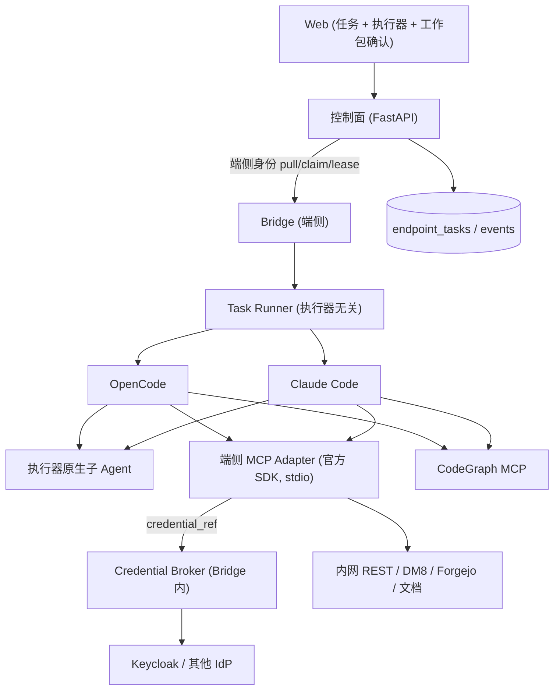

# Skillify 端侧 MCP 与主子 Agent 委派 · 实施计划（plan）

> 日期：2026-07-16
> 上游裁决：`docs/2026-07-16-skillify-endpoint-mcp-and-agent-delegation-design-brief.md`（本轮）；`docs/2026-07-16-skillify-agent-architecture-convergence-review-brief.md`（前轮，已由 Codex 落地：commit `5a94b7e`→`a71e371`）
> 配套任务：`docs/2026-07-16-skillify-endpoint-mcp-and-agent-delegation-task.md`
> 交付对象：Codex 二次评定并实施。目标执行器：**OpenCode + Claude Code**。
> 状态：开发期改造已完成并通过离线定向门禁；真实内网、真实 IdP/DM8 与执行器行为仍待 `[test-env]` 销账。`implemented / dev_verified / env_verified` 三层状态保持分离。所有路径为仓库相对路径（`+`=新增）。

---

## 0. 源码核实结论（先读，均已核对真实源码）

前轮收敛（Code Map→CodeGraph、devpi 解耦、双执行器在线闭环、删自研 Workflow 执行器）**已落地**。本轮针对 **MCP 端侧优先 + Credential Broker + 主子 Agent 委派**。以下为逐项核实。

### 0.1 MCP 子系统

| 项 | 结论 | 证据 |
| --- | --- | --- |
| 手写 `subprocess+select+JSON-RPC` 探测客户端 | **存在，删除**：`registry.py:645-897`（`probe_stdio_mcp`、`_LineReader`、`_rpc`、`_notify`、`_encoded_message`、`_write_message`、`_stop_process`、`_validate_json_tree`、`_reject_duplicate_probe_fields`、`McpProbeResult/Error`、`_PROTOCOL_VERSION="2025-03-26"`、`_MAX_FRAME_BYTES/_MAX_TOTAL_BYTES`）；**无生产调用方**，仅测试/fixture 引用 → 低风险删除 | `mcp/registry.py:645-897`、`mcp/__init__.py:13,27` |
| MCP 治理层 | **保留**：`McpArtifact`、`McpInstallPreview`、`McpRegistry`、`load_mcp_artifact`（argv 限定 `/opt/skillify/mcp/<name>`、禁解释器/shell、凭据 env 限定 `SKILLIFY_MCP_*`）、`render_opencode_mcp`、`mcp_artifact_as_dict`、内网源校验 | `mcp/registry.py:31-642` |
| 官方 MCP Python SDK | **缺失**，需新增并固定版本+哈希 | `pyproject.toml:6-20` 无 `mcp`；`uv.lock` 无 `mcp` 包 |
| 三连接器 db_readonly/forgejo/docs | **进程内 Python 策略引擎，非 stdio MCP server**；`db_readonly` 自研 SQL 安全引擎（`validate_select`/limits/脱敏）；forgejo/docs 较薄（授权+委派后端 Protocol） | `mcp/db_readonly/connector.py`、`mcp/forgejo/connector.py`、`mcp/docs/connector.py` |
| 配置生成器 | **纯渲染，无业务逻辑重复，无凭据落配置**（env 以 `{env:NAME}` 引用） | `agent/opencode_config.py`、`claudecode_config.py`、`codegraph.py` |
| MCP Package manifest 字段 | 具备 coordinate/checksum/commit/license/source/transport/command/environment/permissions/timeout；**缺** `auth_profile`、一等 `credential_ref`、结构化 network allowlist（host+port+protocol）、`scopes`、`tools`/按任务子集、独立 `args` | `mcp/registry.py:97-128,349-565` |

### 0.2 身份与凭据

| 项 | 结论 | 证据 |
| --- | --- | --- |
| Credential Broker / 秘密存储 / Token Exchange / PKCE / Device / Client Credentials | **全部缺失（greenfield）** | `src/` 无 `broker`/`token_exchange`/`keyring` |
| 任务信封是否带明文秘密 | **否，天然满足**（只带 refs/parameters，`_FORBIDDEN_PARAMETER_KEYS` 拒 prompt/shell/command/source） | `tasks/protocol.py:77-141,21,110-112`、`web_store.py:101-134` |
| 子进程凭据注入 | **已正确**：仅注入 env 变量名对应值，最小 env allowlist，`opencode.json`/CLI 不含秘密，0600 | `providers/opencode.py:205-267`、`claudecode.py:89-111`、`provider.py:21,35-44` |
| Keycloak | **仅校验**（RS256+iss+aud+exp），**不校验 scope**，**从不签发/换取** token | `web/auth.py:37-81` |
| **身份混用缺陷** | Endpoint 机器身份**复用了 Web 用户依赖** `require_keycloak_user` 鉴权 → 违反 brief §4.2“四类身份不可混用” | `web/endpoint_agent_api.py:33-38,56` |
| 事件/日志脱敏 | **强**：TaskEvent 闭合 schema + `_DETAIL_KEYS` 白名单；telemetry 明确不采集秘密；`permissions.py:744` credential 审计脱敏 | `tasks/reporting.py:94-127`、`agent/events.py:12-15`、`common/telemetry.py:1-18` |
| CLI credential / doctor 凭据检查 | **缺失** | `cli/` 无 credential 组；`doctor_cmd.py:198-260` 无凭据项 |

### 0.3 委派与工作包

| 项 | 结论 | 证据 |
| --- | --- | --- |
| 自研角色循环/提示词接力/子 Agent 总线 | **已删除（约束满足）** | `workflows/contract.py` 不存在（commit `a139a6f`）；`src/` 无 `execute_workflow/WorkflowRole` |
| Workflow Pack `delegation` 块 | **缺失** | `pack_config.py` 无 delegation；`src/`/`web/` 零命中 |
| Workflow Pack 现有字段 | runtime(opencode\|claude-code)、skills、mode(read-only\|workspace-write)、gates、entryAgent、artifacts、permissions、workflowVersion | `pack_config.py:15,62-103` |
| 工作包（objective/allowed_paths/scope/deps/acceptance/parallel）模型与 UI/API | **缺失**；前端为“固定 workflow 单输入框”，服务端 `WORKFLOW_FORMS` 固定 5 类 | `web/src/views/EndpointTasksView.vue:5-62`、`tasks/web_store.py:16-48` |
| 执行器原生子 Agent 配置 | OpenCode 从 skill pack 安装 `agents` 目录（原生可用）；Claude Code 仅配 CodeGraph MCP | `opencode_config.py:111-112,357-364`、`claudecode_config.py:17-60` |
| 子 Agent/委派事件可见性 | **几乎无**：`EventType` 无子 Agent 事件；OpenCode SSE 仅取顶层 sessionID，**丢弃子会话事件**；Claude Code 事件粗粒度 | `agent/events.py:28-37`、`providers/opencode.py:520`、`claudecode.py:155-167` |
| 按任务动态 MCP 注入 | **未实现**：MCP 按已装 skill 写入**全局** `opencode.json`；权限 allowlist 只能拒用不能按任务注入子集 | `opencode_config.py:366-388`；`permissions.py:410,596` |
| 可复用底座 | `ProviderStartSpec.allowed_paths`、`ModelRuntimeConfig.allowed_endpoint_hosts`、`permissions.py`（路径/网络/MCP allowlist + 最严合并 `:655-679`） | `provider.py:20-77`、`permissions.py` |

### 0.4 用户裁决（本轮，覆盖 brief 开放项）

| 主题 | 裁决 |
| --- | --- |
| 只读参考 Adapter | **两个都做**：REST/OpenAPI 薄 Adapter（包装老系统）+ DM8 数据库只读 Adapter |
| 现有三连接器 | **全部改造为官方 SDK stdio MCP server** |
| 目标执行器 | OpenCode + Claude Code |
| 测试范围 | 开发期只做离线门禁；真实 Keycloak/DM8/内网 E2E 延后 `[test-env]`；三层状态分开标记 |

### 0.5 诚实边界（沿用）
- **`dmpython==2.5.32`（DM8 驱动）无 macOS wheel** → 本 macOS 机不能 `pytest`；离线单测**以 Linux（Codex）为准**。DM8 Adapter 的真实方言验证天然属 `[test-env]`，离线用 `SQLiteReadExecutor` 替身。
- 官方 MCP SDK 的 **stdio 本地往返可离线验证**（两端都在本机，无公网）；只有真实内网服务/IdP 往返属 `[test-env]`。

---

## 1. 评测方案合理性评估（用户要求）

对 brief 第 8、11 节测试/验收方案的评估与修正建议：

**合理之处（采纳）：**
- `implemented / dev_verified / env_verified` 三层状态**优于**布尔勾选，杜绝“代码存在=完成”。采纳为 task 强制字段。
- 独立编码环境跳过真实内网 E2E**合理**：无目标服务时真机验收无意义。
- 端侧优先 + stdio + 无服务器沙箱，使**多数关键属性可在本机离线证明**（见下）。

**必须修正/补强（写入 task 门禁）：**
1. **安全不变量必须是离线硬门禁，不得延后。** 以下 brief §11 项**可离线证明**，应作为 `dev_verified` 硬 Gate，而非只等 `[test-env]`：
   - 秘密不进配置/CLI/日志/事件/信封：静态 grep/AST 断言 + 闭合 schema 单测 + `.mcp.json`/`opencode.json` 快照断言。
   - Adapter 薄：契约测试断言无 `execute_anything/execute_any_sql/legacy_system_call`、无任意 URL/Shell/SQL、scope/读写/行数/超时/网络目标校验。
   - Token 只经 env/Unix socket 注入、配置仅 `credential_ref`：注入路径单测 + 配置快照。
2. **MCP SDK stdio 生命周期应 `dev_verified`，非仅 `[test-env]`。** 用官方 SDK 的**本地 stdio echo/参考 server**做 client↔server 往返（initialize/tools/list/tools/call/cancel）离线跑通；只有连真实内网服务才 `[test-env]`。
3. **Credential Broker 分层验收。** 状态机、`credential_ref` 解析、注入、刷新调度、清理(cancel/exit/timeout)、本机加密存储(0600)/keyring 抽象、脱敏审计 → 全部 `dev_verified`（fake IdP）。仅真实 PKCE/Device/Token-Exchange/mTLS 往返 → `env_verified`。
4. **执行器兼容性是 `[test-env]` 前置风险，需显式登记。** 按任务注入最小 MCP 子集、子 Agent 事件可见性**依赖 OpenCode/Claude Code 实际支持**（per-session MCP 配置、子会话事件）。brief §6.4 已提示“不依赖执行器未承诺的内部事件”——据此：控制面只记录执行器**已暴露**的标准事件，委派内部不作硬依赖。任一执行器不支持 per-task MCP 配置时，回退“全局装 + 权限 allowlist 按任务拒用”，并 `log` 降级。
5. **运行期无公网静态门禁。** 断言 CodeGraph/SDK/Adapter 运行期 env 含 `*_NO_DOWNLOAD/NO_TELEMETRY`、network allowlist 默认 deny；离线可测。
6. **`[test-env]` 清单是一等产物**：每个延后项在 task 里成条销账，未销账不得宣称上线可用。

**结论：** brief 测试方案方向正确，但**低估了可离线证明的安全属性**。本计划把秘密隔离、Adapter 薄、SDK stdio 往返、Broker 状态机全部上提为开发期硬门禁，真机只留 IdP/内网服务/DM8 方言/执行器行为四类。

---

## 2. 目标架构与边界



**边界不变量：**
- 服务端只下发 `auth_profile` + `credential_ref`，**永不下发明文 Token/Secret**；不建通用 MCP Runtime、不建服务器沙箱、不代理 MCP 流量。
- MCP Adapter 端侧、stdio、薄：只做参数映射、调用老系统、Broker 取短期凭据、scope/字段/行数/超时/网络/只读校验、输出裁剪脱敏审计。**禁** Agent Loop / 固定角色流程 / 万能执行 / 任意 URL·Shell·SQL。
- 主子 Agent 调度由 OpenCode/Claude Code 原生承担；Skillify 只提供拆分建议、工作包编辑、权限审批、标准事件记录。
- 四类身份分离：Web 用户 / Endpoint 机器 / 用户委托业务 / 服务账号，各自 audience+scope+有效期+目标系统。

---

## 3. 保留 / 删除 / 迁移 / 新增清单

### 3.1 删除（DELETE）
```
src/skillify/mcp/registry.py            # 删 645-897 手写探测协议段（见 0.1）；及 _PROTOCOL_VERSION/_MAX_FRAME_BYTES/_MAX_TOTAL_BYTES/_LineReader 等仅探测使用者
src/skillify/mcp/__init__.py            # 删 probe 相关导出 (line 13,27)
tests/test_mcp_remote_smoke.py          # 手写探测 smoke → 重写为 SDK client 契约测试（见 4.1）
tests/fixtures/mcp_echo_server.py       # 保留/改造为 SDK 参考 echo server（见 4.1，可迁移不删）
```
> 删除前确认 `probe_stdio_mcp` 无 `src/` 生产调用（已核实：仅测试）。保留 `_MAX_ARG/_MAX_ARGS/_ENV_RE/_validate_timeout`（`load_mcp_artifact`/`render_opencode_mcp` 仍用）。

### 3.2 保留（KEEP，禁止误删）
`registry.py:31-642` 全部治理；`mcp/scope.py`（连接器 scope 模型）；三连接器的**策略引擎核心**（`validate_select`/limits/脱敏、forgejo/docs 授权+后端 Protocol）；`permissions.py` 全部；`provider.py` allowed_paths/host allowlist；`codegraph.py`/配置生成器。

### 3.3 迁移/改造（MODIFY）
```
src/skillify/mcp/registry.py            # McpArtifact 扩展：auth_profile、credential_ref、network allowlist(host+port+protocol)、scopes、tools(含 summary+context budget)、args（与 command 分离）
src/skillify/mcp/db_readonly/connector.py   # 策略引擎保留；改造为经 SDK stdio server 暴露（DM8 只读 Adapter 核心）
src/skillify/mcp/forgejo/connector.py       # 经 SDK stdio server 暴露
src/skillify/mcp/docs/connector.py          # 经 SDK stdio server 暴露
src/skillify/web/auth.py                     # 增 scope 校验能力（供目标服务/委托）
src/skillify/web/endpoint_agent_api.py       # 端点鉴权改用独立 Endpoint 机器身份依赖（见 3.4 endpoint_auth）
src/skillify/workflows/pack_config.py        # 增 delegation 块、一等 mcp 字段、work-package/acceptance、命名 gate 分类
src/skillify/agent/providers/opencode.py     # MCP 注入改任务作用域；凭据经 Broker socket/env
src/skillify/agent/providers/claudecode.py   # 同上；task-scoped .mcp.json
src/skillify/agent/runner.py                 # 启动 Adapter 前拉起 Broker；task-scoped MCP 配置
src/skillify/cli/doctor_cmd.py               # 增凭据存在/过期报告（不输出内容）
web/src/views/EndpointTasksView.vue          # 委派模式 + 工作包编辑/确认 UI
web/src/lib/api.js                           # 工作包/委派字段
```

### 3.4 新增（CREATE）
```
+infra/offline/mcp-sdk-manifest.json         # 官方 MCP SDK 离线制品：version/sha256/license/intranetUri（复用 codegraph-manifest 校验原语）
+src/skillify/mcp/sdk_client.py              # 官方 SDK 客户端封装：probe/initialize/tools.list/tools.call/cancel（替代手写探测）
+src/skillify/mcp/server/__init__.py         # SDK stdio server 框架：skillctl mcp serve <name> 分发到各 Adapter
+src/skillify/mcp/rest/adapter.py            # REST/OpenAPI 薄 Adapter（包装老系统）
+src/skillify/mcp/db_readonly/dm8_executor.py # 真实 DM8 ReadExecutor（[test-env]；离线用 SQLiteReadExecutor）
+src/skillify/cli/mcp_cmd.py                  # skillctl mcp serve/probe/list（若不存在）
+src/skillify/credentials/__init__.py         # Credential Broker 包
+src/skillify/credentials/broker.py           # 解析 auth_profile→credential_ref、用户批准、注入、刷新、清理、脱敏审计
+src/skillify/credentials/identities.py        # 四身份抽象：web-user / endpoint / user-delegated(PKCE/Device/Token-Exchange) / service-account(Client Credentials)
+src/skillify/credentials/store.py             # 本机秘密存储：keyring/Secret Service/TPM，降级加密文件(0600)
+src/skillify/credentials/injection.py         # Unix socket / per-process env 注入；禁 CLI/配置
+src/skillify/web/endpoint_auth.py             # 独立 Endpoint 机器身份依赖（device token/mTLS，替代 require_keycloak_user 混用）
+src/skillify/cli/credential_cmd.py            # credential add/list/status/revoke（list 不显秘密）
+src/skillify/tasks/work_package.py            # 工作包模型：objective/allowed_paths/deps/read-write scope/recommended skill+mcp/acceptance commands/parallelizable
+src/skillify/tasks/mcp_injection.py           # 按任务最小 MCP 子集选择 → task-scoped 配置生成
```

---

## 4. 关键方案

### 4.1 MCP 官方 SDK 替换
- 依赖：`pyproject.toml` 增 `mcp==<pinned v1>`；`uv.lock` 锁哈希；devpi 镜像；`infra/offline/mcp-sdk-manifest.json` 记 version/sha256/license/intranetUri（复用 `codegraph.py:load_manifest/verify_artifact` sha256 原语）。
- 删手写探测（3.1），新增 `sdk_client.py` 用 SDK 做 `initialize/tools.list/tools.call/cancel`；SDK 负责协议协商、stdio 生命周期、错误与取消。
- 离线验证：保留一个**本地 SDK 参考 stdio server**（由 `mcp_echo_server` 改造）做 client↔server 往返，`dev_verified`。v2 稳定前不入生产。

### 4.2 Adapter 为 SDK stdio server（薄）
- 统一入口 `skillctl mcp serve <name>`（对应 manifest `runtime.command: skillctl, args:[mcp,serve,<name>]`）。
- 四个 Adapter：**REST/OpenAPI**（新，fake HTTP 离线端到端）、**DM8 只读**（db_readonly 策略引擎 + SQLite 离线 / DM8 `[test-env]`）、**Forgejo**、**文档**。全部经 SDK server 暴露原子化、读写分离工具（`ticket.read/search/comment/create/close` 式）。
- 薄约束契约测试（离线硬门禁）：无 `execute_*`/任意 URL·Shell·SQL；scope/字段/行数/超时/网络目标/只读校验；输出裁剪脱敏。

### 4.3 Credential Broker 与四身份
- 服务端只发 `auth_profile`+`credential_ref`；Broker（Bridge 内）解析 → 检查用户已批准 scope → 触发 PKCE/Device 登录或 Token Exchange/Client Credentials → 刷新短期 token → 经 **Unix socket / per-process env** 注入 Adapter → 内存/keyring 缓存 → cancel/exit/timeout 清理 → 生成**不含秘密**审计。
- 四身份分离：修复 Endpoint 机器身份混用（`endpoint_auth.py` 独立依赖）；新增用户委托(#3)与服务账号(#4)接口抽象。
- 目标服务校验 `iss/aud/exp/scope`；不把 Web token 原样转发；每 Adapter/目标独立 client，不共用万能服务账号；写权限默认不给服务账号。
- 开发期：状态机 + 存储 + 注入 + 脱敏用 fake IdP 离线全测；真实 IdP/mTLS 往返 `[test-env]`。

### 4.4 委派与工作包
- Pack `delegation: {mode: adaptive|suggested|required, user_approval: required, executor_managed: true}`（默认 suggested）。
- 工作包模型（`work_package.py`）：objective/allowed_paths/deps/read-write scope/推荐 skill+mcp/acceptance commands/parallelizable。用户在 Web 确认或编辑**工作包**（非固定角色）。
- `required` 只约束结果（≥N 独立工作包、高风险独立只读审查、Worker 不越 allowed_paths、必出构件+过验收、Coordinator 无写权限必须委派）；**禁**逐轮发提示词/自建子 Agent 协议/跨执行器混合/管理执行器上下文压缩。
- 执行器原生管理子 Agent；控制面只记录已暴露标准事件（`§1.4`）。

### 4.5 按任务最小 MCP 注入
- `mcp_injection.py`：按任务声明生成 **task-scoped** MCP 配置（写入任务工作区/配置目录，非全局 user 配置）。OpenCode 用 project-scoped `opencode.json`；Claude Code 用 `--mcp-config`/项目 `.mcp.json`。
- 不支持 per-task 配置的执行器 → 回退全局装 + 权限 allowlist 按任务拒用，并 `log` 降级（`[test-env]` 校验执行器实际支持）。

---

## 5. 数据模型 / API / schema 迁移
```
+infra/dm8-init/08-work-packages.sql         # 工作包表（task_id 外键、objective、allowed_paths、scope、deps、acceptance、parallelizable、confirm 状态）；SQLite 镜像离线
 infra/dm8-init/06-endpoint-tasks.sql        # 不变
 src/skillify/index/models.py                # WorkPackageRecord；endpoint 机器身份字段（若采 device token）
```
- McpArtifact 扩展（3.3）为**向后兼容**：新字段可选/默认；旧 manifest 仍可加载（`load_mcp_artifact` 增字段解析，缺省安全）。
- 先 expand 后 contract；真实 DM8 方言 `[test-env]`。

---

## 6. 安全边界 / 失败路径 / 回滚
- **失败路径**（均须产生明确事件，离线可测）：取消、超时、Token 过期、API 403、网络不通、Adapter 崩溃、scope 未批准、越权 allowed_paths、per-task MCP 不支持降级。
- **秘密隔离硬门禁**：静态断言秘密不进配置/CLI/日志/事件/信封（`§1.1`）。
- **回滚**：SDK 替换、Adapter 改造、Broker、委派各自独立 commit，可单独 revert；DM8 迁移 08 独立文件；McpArtifact 扩展向后兼容，回退不破坏旧包。

---

## 7. 开发期验证与 [test-env] 分层
- **Dev-DoD（Linux/Codex，离线硬门禁）**：`uv run python -m compileall -q src`；`uv run pytest -q`（fake IdP/fake HTTP/SQLite/本地 SDK stdio）；`cd web && npm run type-check && npm test && npm run build`。
- **[test-env]（延后销账）**：真实 Keycloak PKCE/Device/Token-Exchange/mTLS；真实 DM8 方言；真实内网 REST/Forgejo/文档；OpenCode/Claude Code per-task MCP 与子 Agent 行为；官方 SDK 对真实 server 的 stdio 往返；全链路 E2E（brief §11）。

---

## 8. 明确不做（Non-Goals）
通用远程 MCP Gateway；ContextForge/ToolHive；服务器沙箱/MCP 容器集群；所有老系统一次性 MCP 化；跨执行器主子 Agent；Skillify 自研 Agent Runtime；全自动高风险写；手写 MCP 协议栈；代理所有 MCP 流量；一次性注入全部 MCP；万能 `execute_anything/execute_any_sql/legacy_system_call`；任意 URL·Shell·SQL；在独立编码环境强制真实 IdP/DM8/内网 E2E；恢复自研角色循环/提示词接力/子 Agent 总线；MCP SDK v2 进生产（稳定+内网验证前）。

---

## 9. 交付说明
- 三层状态：`implemented`（代码合入）/`dev_verified`（离线门禁过）/`env_verified`（[test-env] 销账）分开标记，任一未达不得宣称对应层完成。
- 逐 Task 见配套 task.md，含依赖/文件/失败测试/最小实现/删除项/验证命令/完成证据/commit/Gate/三层状态/**指导意见**。
