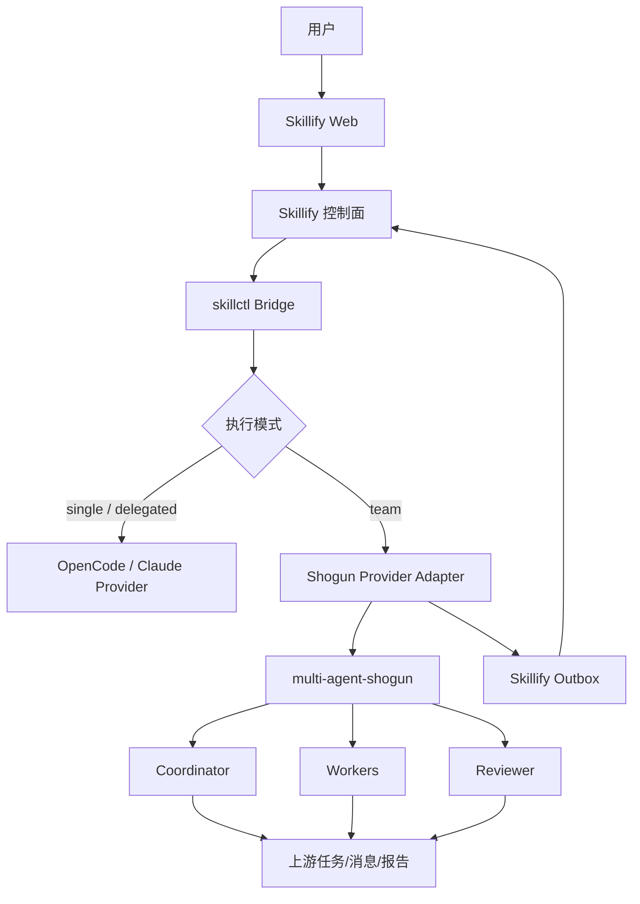

# Skillify 引入 multi-agent-shogun 端侧 Team Runtime 设计裁决

> 日期：2026-07-18  
> 文档性质：架构裁决、源码评审输入、Plan/Task 生成约束  
> 下游流程：Claude Opus 源码级评审 → 输出 `plan.md` / `task.md` → Codex 二次评定 → 开发  
> 关联文档：`2026-07-16-skillify-agent-architecture-convergence-review-brief.md`、`2026-07-16-skillify-endpoint-mcp-and-agent-delegation-design-brief.md`  
> 当前阶段：尚未进入 MVP；允许调整底座。当前独立编码环境可暂不执行真实内网 E2E，但实现状态与环境验收状态必须分开。

---

## 1. 最终裁决

批准引入 GitHub 项目 [`yohey-w/multi-agent-shogun`](https://github.com/yohey-w/multi-agent-shogun)，但必须采用以下定位：

> **multi-agent-shogun 是端侧外部 Team Runtime，负责多个真实 Agent CLI 实例的启动、任务依赖、Agent 消息、任务领取和结构化报告；Skillify 继续负责用户、端点、任务、工作包、审批、权限、构件、凭据引用和审计。**

禁止把 Shogun 源码复制进 Skillify，禁止 fork 后改造成 Skillify 子模块，禁止重新实现其 YAML 队列、inotify 通知、tmux Agent 生命周期和 Agent 通讯机制。

### 1.1 收敛后的执行模式

| 模式 | 执行底座 | 使用场景 |
|---|---|---|
| `single` | Skillify 直接启动 OpenCode/Claude Code Provider | 小任务、单文件、文本处理 |
| `delegated` | OpenCode/Claude Code 原生 Subagents | 中型任务、上下文拆分、不要求 Worker 互相通讯 |
| `team` | multi-agent-shogun | 真实多 Agent 协作、共享依赖、跨模块任务、独立审查 |

Skillify 不再为 `team` 模式自研：

- 主/子 Agent 消息总线；
- Worker 收件箱；
- 任务抢占与依赖解锁；
- tmux/PTY 多会话管理；
- 固定角色串行循环；
- Agent 间轮询；
- 多执行器混合调度协议。

这些全部交给 Shogun。

---

## 2. 为什么引入 Shogun

当前两套 CLI 的原生能力不完全一致：

- Claude Code 普通 Subagents 拥有独立上下文，但只向主 Agent 回报；
- Claude Code Agent Teams 支持共享任务与直接消息，但仍为实验功能，恢复与任务状态存在限制；
- OpenCode 支持 Primary Agent、Subagents、Task 权限和子会话，但没有与 Claude Agent Teams 等价的公开共享任务/点对点通讯能力。

Shogun 已经提供：

- Claude Code、OpenCode、Codex 等真实 CLI 实例的端侧运行；
- tmux 多会话；
- YAML 命令、任务、收件箱和报告；
- inotify 事件唤醒；
- 任务依赖与自动解锁；
- 单写者状态聚合；
- 多 CLI 角色配置；
- 本地持久任务记录；
- OpenCode Agent 定义和权限配置；
- MIT 许可证。

截至本文生成时，上游 Release 页面显示 v5.0 将 OpenCode 提升为一级支持，v5.1 将 Karo 进一步定位为流量协调者。Claude Opus 必须在生成计划前重新核实上游具体 tag、commit、文件结构、依赖、许可证和真实能力，不得只依据本文描述。

---

## 3. 目标架构



### 3.1 Skillify 控制面继续拥有

- Web 任务创建与用户身份；
- Endpoint 绑定；
- Workspace Alias 与 allowed paths；
- 用户确认的工作包；
- Skill/MCP/网络/命令权限；
- Plan、Build 和高风险写操作审批；
- `single/delegated/team` 执行模式选择；
- 端侧任务 claim/lease/heartbeat/cancel；
- 标准任务事件和审计；
- Agent、Shogun、MCP、CodeGraph 的离线构件版本；
- 结果摘要、diff、测试、构件与失败原因展示。

### 3.2 Shogun Runtime 拥有

- Team 内部 Agent 拓扑；
- 多 CLI 进程和 tmux 会话；
- Agent 收件箱和消息投递；
- Team 内部任务状态与依赖；
- Worker 领取、完成和报告；
- Agent 唤醒；
- Team 内部结构化报告汇总；
- 上游运行期文件锁和并发安全。

### 3.3 OpenCode/Claude Code 拥有

- Agent Loop；
- 模型调用；
- 工具选择；
- 文件、Shell、Git和测试；
- Skills/MCP使用；
- 子任务内部推理；
- 上下文压缩。

---

## 4. 集成方式：外部不可变构件，不复制源码

### 4.1 离线构件

建议新增：

```text
infra/offline/shogun-manifest.json
```

至少记录：

```json
{
  "name": "multi-agent-shogun",
  "source": "yohey-w/multi-agent-shogun",
  "version": "<approved-tag>",
  "commit": "<approved-commit>",
  "license": "MIT",
  "sha256": "<offline-artifact-sha256>",
  "platform": ["linux-x86_64"]
}
```

要求：

- 外网审核区下载 tag 对应的不可变 tarball；
- 完成许可证、依赖、Shell脚本与供应链审查；
- 上传 Forgejo Release；
- Skillify 只安装批准版本；
- 禁止运行时 `git clone`、`curl`、`npm install` 或其他公网下载；
- 升级必须重新走兼容验证和审批；
- 不跟踪上游 `main`。

### 4.2 不采用的接入方式

- 不使用 Git submodule；
- 不复制其 `scripts/`、`queue/`、`instructions/` 到 Skillify；
- 不修改上游主题词和内部文件格式；
- 不以 Shogun Dashboard 替代 Skillify Web；
- 不将 Shogun 队列作为服务端真相源；
- 不让 Shogun 直接访问 Skillify服务端。

---

## 5. Shogun Provider Adapter

建议新增一个薄适配器，例如：

```text
src/skillify/agent/providers/shogun.py
```

具体路径必须由 Opus基于真实源码确定。

### 5.1 Adapter允许做的事情

1. 校验 Shogun批准版本与构件哈希；
2. 检查 `bash`、`tmux`、Python、PyYAML、inotify等本机依赖；
3. 为每个 Skillify Task创建隔离运行目录；
4. 根据任务生成最小上游配置；
5. 选择全 OpenCode、全 Claude Code或未来混合 formation；
6. 将用户确认的 WorkPackage转换为上游入口任务；
7. 启动、监控、取消和清理上游 Team；
8. 只读取上游稳定输出文件或事件；
9. 映射为 Skillify标准事件；
10. 通过 Outbox幂等上报；
11. 归档报告、测试结果、diff摘要和构件索引；
12. 任务结束后清理临时令牌和无用运行目录。

### 5.2 Adapter禁止做的事情

- 自己分解任务；
- 自己决定 Worker间消息内容；
- 重新实现 YAML队列和锁；
- 向 tmux pane注入任意未经验证的 Shell文本；
- 依赖解析 Shogun人类可视 Dashboard作为唯一机器接口；
- 修改上游队列文件以伪造完成状态；
- 在 Adapter里实现 Agent角色循环；
- 直接管理模型上下文；
- 把上游内部状态同步成第二套服务端编排状态机。

---

## 6. 任务与工作包映射

Skillify输入保持中立：

```yaml
execution:
  mode: team
  collaboration_runtime: shogun
  preferred_cli: opencode

team_policy:
  min_workers: 2
  max_active_workers: 3
  max_parallel_model_calls: 3
  require_independent_review: true

work_packages:
  - id: backend-api
    objective: 实现任务领取与事件回传接口
    allowed_paths:
      - src/skillify/web
      - src/skillify/tasks
    verification:
      - uv run pytest tests/test_endpoint_agent_api.py -q

  - id: bridge
    objective: 将任务连接到端侧执行器
    allowed_paths:
      - src/skillify/cli
      - src/skillify/agent
    depends_on:
      - backend-api

  - id: review
    objective: 独立检查权限、幂等和失败路径
    read_only: true
    depends_on:
      - backend-api
      - bridge
```

Adapter只做字段转换，不把 Shogun/Karo/Ashigaru/Gunshi主题词暴露给普通用户。

### 6.1 UI显示名称映射

| 上游概念 | Skillify显示 |
|---|---|
| Shogun/Lord入口 | Task Owner/User |
| Karo | Coordinator |
| Ashigaru | Worker |
| Gunshi | Reviewer/Strategist |

映射只用于UI和事件展示，不修改上游源码与内部标识。

---

## 7. 标准事件模型

Skillify不得把上游所有内部消息原样上传。只标准化对用户有意义的生命周期事件：

```text
team.preparing
team.started
worker.started
work_package.assigned
work_package.blocked
work_package.started
work_package.completed
review.started
review.completed
team.waiting_approval
team.cancelling
team.cancelled
team.completed
team.failed
```

每个事件至少包含：

```yaml
event_id: <uuid>
task_id: <skillify-task-id>
runtime: shogun
worker_id: <optional-stable-id>
work_package_id: <optional-id>
stage: <normalized-stage>
summary: <redacted-summary>
artifact_refs: []
occurred_at: <timestamp>
```

禁止上报：

- 模型API Key；
- Keycloak Token；
- MCP凭据；
- 完整环境变量；
- CLI完整原始对话；
- 老系统响应中的敏感数据；
- 任意未经脱敏的上游 YAML文件。

### 7.1 真相源边界

- 服务端任务与审批状态：DM8是唯一真相源；
- 端侧待上传事件：Bridge Outbox；
- Team内部任务和消息：Shogun运行目录；
- 源码与最终不可变构件：Forgejo；
- Shogun内部状态不得直接覆盖Skillify服务端状态，只能通过合法事件触发受控转换。

---

## 8. 权限与安全裁决

### 8.1 禁止危险自动权限模式

严禁在Skillify托管任务中使用：

```text
--dangerously-skip-permissions
```

即使上游提供相应选项，也必须由Skillify生成最小权限配置。

### 8.2 角色权限建议

| 角色 | 权限 |
|---|---|
| Coordinator | 任务拆分、读取报告；默认禁止编辑和高风险Shell |
| Explorer | 只读源码、CodeGraph；禁止写入 |
| Implementation Worker | 仅工作包allowed paths可写；受限Shell |
| Test Worker | 测试目录与指定测试命令；默认不改业务代码 |
| Reviewer | 只读diff、测试结果和构件；禁止编辑 |
| Integration Worker | 仅在需要合并工作树时启用；Git push默认禁止 |

### 8.3 工作目录隔离

Claude Opus必须评估并裁决：

- Shogun上游是否已经提供每Worker worktree隔离；
- 如果没有，是否可通过上游公开配置安全实现；
- 如果必须修改上游源码才能支持，不得直接实施，应列为上游贡献或阻塞项；
- 没有worktree时，第一阶段只允许按互斥目录划分工作包；
- 两个Worker不得同时修改同一文件；
- 合并只能由一个指定Integration角色执行。

### 8.4 MCP与凭据

- 每个Worker只加载其工作包声明的MCP；
- CodeGraph可按需提供；
- 数据库/业务API MCP不得默认注入所有Worker；
- Token仍由端侧Credential Broker获取；
- Shogun配置、任务YAML和tmux命令中只能出现`credential_ref`，不能出现秘密；
- Adapter不得把Skillify Web Token转发给上游Agent。

### 8.5 网络

- 禁止ntfy、Tailscale和任何公网通知默认启用；
- 禁止上游安装脚本联网下载；
- 仅允许内网模型地址、Skillify地址和工作包声明的MCP/API目标；
- 遥测、更新检查和插件自动安装必须关闭；
- 网络allowlist由Skillify策略与MCP Package交集决定。

---

## 9. 并发与内网模型保护

Shogun可以启动多个CLI实例，但不得默认让全部Worker同时产生模型调用。

建议默认：

```yaml
team_policy:
  min_workers: 2
  max_active_workers: 3
  max_parallel_model_calls: 2
  max_team_duration_minutes: 120
```

必须同时支持：

- 单Endpoint最大并行Team数；
- 单Team最大活动Worker数；
- 单模型端点最大并发请求数；
- 单用户并发任务数；
- 排队而非超限启动；
- 429/503退避；
- Worker超时和失联；
- 主协调Agent提前结束时的失败检测；
- 空闲Worker不产生模型调用。

并发策略属于端侧资源治理，不得演变成第二套Agent任务编排器。

---

## 10. 运行生命周期

### 10.1 正常路径

1. Web创建`team`任务；
2. 用户确认工作包、目录、Skills、MCP和权限；
3. Bridge claim任务并创建隔离运行目录；
4. Adapter校验Shogun和CLI版本；
5. Adapter生成最小配置和入口任务；
6. 启动Shogun Team；
7. Shogun负责Team内部任务、消息与报告；
8. Adapter持续转换标准事件到Outbox；
9. 审批Gate触发时暂停高风险后续动作；
10. 用户批准后恢复；
11. Team完成，Adapter采集摘要、测试、diff和构件；
12. 清理tmux、子进程和临时凭据；
13. 结果上传Skillify并归档端侧运行摘要。

### 10.2 必须覆盖的失败路径

- Shogun构件缺失或哈希不符；
- tmux/inotify/Python依赖缺失；
- Claude Code/OpenCode未安装或版本不兼容；
- 内网模型不可达；
- Worker未启动；
- Worker卡死；
- 任务依赖长期阻塞；
- 两Worker产生文件冲突；
- 用户拒绝权限；
- 等待审批超时；
- Bridge网络中断；
- 服务端重复pull或重复event；
- 任务取消；
- Bridge被SIGTERM；
- tmux遗留session；
- Adapter崩溃后恢复；
- Shogun内部显示完成但验收命令失败；
- 敏感信息脱敏失败。

---

## 11. 上游能力不得盲信

Claude Opus必须直接检查Shogun源码，重点回答：

1. v5.1的真实tag、commit和LICENSE；
2. OpenCode一级支持的实际实现文件和启动参数；
3. 是否支持非交互/后台运行；
4. Agent数量是否可配置，还是固定formation；
5. 空闲CLI是否产生模型调用；
6. YAML队列是否有稳定机器契约；
7. inbox_write、锁、inotify和状态更新的真实语义；
8. 是否能禁用Dashboard、ntfy、Tailscale等非必要功能；
9. 是否支持按任务独立运行目录；
10. 是否支持安全取消和清理所有tmux/子进程；
11. 是否支持Git worktree或互斥文件所有权；
12. 权限配置能否满足Skillify最小权限；
13. Claude Code与OpenCode能否分别使用内网模型端点；
14. 是否有运行时自动下载、更新或遥测；
15. 上游文件格式变动时Adapter如何版本化；
16. 哪些能力只能通过修改上游才能实现；
17. 哪些功能与Skillify现有Bridge/Outbox/Workflow代码重复，应删除或停用；
18. 当前Skillify此前声称完成的多Agent能力究竟是原生Subagent、FakeProvider还是实际Team协作。

如果关键能力需要fork或大幅修改上游，Opus必须明确提出`NO-GO`或缩小范围，不得为了完成计划而重新造轮子。

---

## 12. Go/No-Go门禁

引入不是无条件接受。编码阶段可以先完成Adapter骨架和FakeRuntime契约；正式启用`team`模式前必须满足：

| 门禁 | 必须结果 |
|---|---|
| License | MIT确认，NOTICE处理明确 |
| Offline | 无运行时公网下载、更新和遥测 |
| Linux | 目标发行版/CPU/glibc可用 |
| OpenCode | 全OpenCode formation可启动并完成任务 |
| Claude Code | 全Claude formation可启动并完成任务 |
| Lifecycle | 启动、取消、超时、崩溃、清理无遗留进程 |
| Security | 不使用dangerous skip；凭据不落日志/YAML |
| Events | 稳定转换为Skillify事件，重复事件可幂等 |
| Workspace | Worker不会互相覆盖文件 |
| Concurrency | 最大活动Worker与模型并发可限制 |
| Recovery | Bridge重启后可识别已有Team并继续上报或安全终止 |

任一关键门禁未过：

- `single`和`delegated`仍可继续；
- `team`模式保持不可用；
- 不恢复Skillify自研Team通讯；
- 不以旧自研Workflow Runtime作为兜底。

---

## 13. 建议实施阶段

### S0：源码与上游核实

- Skillify现状核实；
- Shogun tag/commit/license/dependency核实；
- 重复能力和删除边界；
- Go/No-Go风险报告。

### S1：协作契约

- `execution.mode`；
- `collaboration_runtime`；
- `team_policy`；
- WorkPackage；
- 标准Team事件；
- implemented/dev_verified/env_verified状态。

### S2：离线构件与Doctor

- Shogun manifest；
- Forgejo Release；
- 哈希校验；
- 依赖检查；
- 禁公网配置。

### S3：Shogun Provider Adapter

- 任务目录；
- 配置生成；
- 启停；
- Fake Shogun契约；
- 上游事件映射；
- 取消与清理。

### S4：权限与Credential Broker接线

- 角色权限；
- allowed paths；
- MCP最小注入；
- 凭据引用；
- 日志脱敏；
- 网络allowlist。

### S5：Bridge与Web接入

- `team`模式选择；
- 用户工作包确认；
- Team/Worker时间线；
- Outbox幂等；
- 恢复与取消。

### S6：全OpenCode formation

- OpenCode配置；
- 内网模型；
- 2～3 Worker；
- 独立Reviewer；
- 真实代码任务。

### S7：全Claude Code formation

- Claude配置；
- 内网模型兼容；
- 2～3 Worker；
- 独立Reviewer；
- 真实代码任务。

### S8：混合formation（延后）

- 仅在全OpenCode与全Claude分别稳定后评估；
- 不作为第一阶段上线门禁。

---

## 14. Non-Goals

- 不fork multi-agent-shogun；
- 不重写上游通讯；
- 不把Shogun做成服务器集群；
- 不建设服务器代码沙箱；
- 不引入LangGraph/CrewAI/AutoGen/Temporal/Ruflo/Metaswarm形成第二编排栈；
- 不同时维护Skillify自研Team Runtime；
- 不把Claude Agent Teams作为Team模式的第二实现；
- 不要求OpenCode伪装具备Teammate点对点消息；
- 不把所有任务强制升级为Team；
- 不把所有Worker开放全部MCP；
- 不启用公网通知、Tailscale、ntfy；
- 不向普通用户暴露上游武士主题词；
- 不在第一阶段支持任意数量、任意CLI、任意模型混编。

---

## 15. Claude Opus输出要求

请输出两份带日期文件：

```text
docs/<date>-skillify-shogun-team-runtime-plan.md
docs/<date>-skillify-shogun-team-runtime-task.md
```

### 15.1 Plan必须包含

- Skillify源码核实结论；
- Shogun源码和Release核实结论；
- 本文错误或高估之处的纠正；
- 接受/拒绝/条件接受结论；
- 精确KEEP/DELETE/MIGRATE/CREATE清单；
- Provider Adapter契约；
- WorkPackage和事件Schema；
- 离线分发；
- 权限、凭据、网络；
- tmux/进程生命周期；
- 并发与模型保护；
- Bridge/Web/DM8接线；
- 失败路径；
- 回滚；
- Dev验证与`[test-env]`门禁；
- Non-Goals。

### 15.2 Task必须包含

每个Task必须有：

- 依赖；
- Owner；
- 精确文件路径；
- 先失败测试；
- 最小实现；
- 删除项；
- 验证命令；
- 可审计完成证据；
- commit边界；
- Gate；
- `implemented/dev_verified/env_verified`三层状态。

不得在尚未真实验证Shogun、OpenCode、Claude Code、tmux和内网模型时，把环境验收标记为完成。

---

## 16. 可直接交给Claude Opus的开场指令

> 请完整阅读 `docs/reviews/2026-07-18-skillify-shogun-team-runtime-integration-brief.md` 以及此前Skillify Agent/MCP架构收敛文档，然后对Skillify仓库和`yohey-w/multi-agent-shogun`批准候选版本做源码级核实。当前尚未进入MVP，允许修正底座，但核心原则是不要重复造轮子。目标是将Shogun作为端侧外部Team Runtime：Skillify负责用户、任务、工作包、审批、权限、凭据引用和审计；Shogun负责多CLI实例、任务依赖、Agent消息与报告；OpenCode/Claude Code负责推理和工具执行。禁止fork、复制或重写Shogun通讯代码，禁止恢复Skillify自研Team Runtime，禁止使用`--dangerously-skip-permissions`。请先指出本文与真实源码不符之处，再输出带日期的plan和task文件。当前可以跳过真实内网E2E，但必须严格区分implemented、dev_verified和env_verified。输出后停止，等待Codex二次评定。

---

## 17. 最终验收定义

只有以下条件全部满足，才能宣称Skillify Team模式上线可用：

- Web可创建`team`任务并确认工作包；
- Bridge出站领取任务并启动批准版本Shogun；
- 无公网下载、更新或遥测；
- Shogun真实启动多个批准的OpenCode或Claude Code CLI实例；
- Team内部任务依赖、消息和报告由上游负责；
- Skillify不运行第二套Team通讯；
- 每个Worker遵守目录、命令、MCP和网络权限；
- 凭据不进入YAML、日志、命令行和Agent上下文；
- 代码修改无并发覆盖；
- 独立Reviewer完成验收；
- 取消、断网、崩溃和Bridge重启可以恢复或安全终止；
- tmux和子进程全部清理；
- Outbox事件幂等回传；
- Web展示真实Team/Worker时间线、测试、diff和构件；
- 全OpenCode与全Claude Code formation各完成一次真实内网端到端任务。

